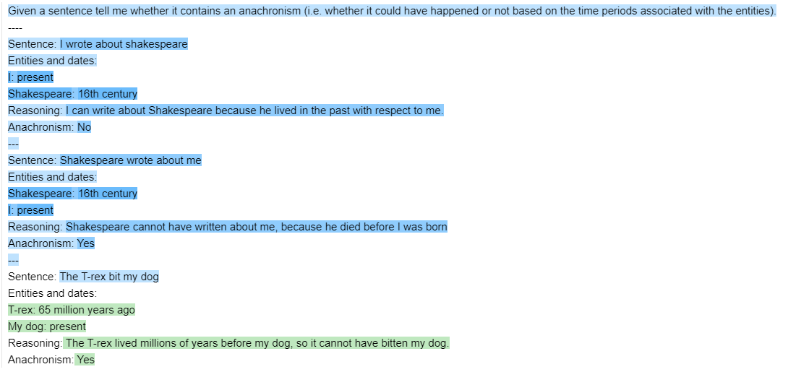
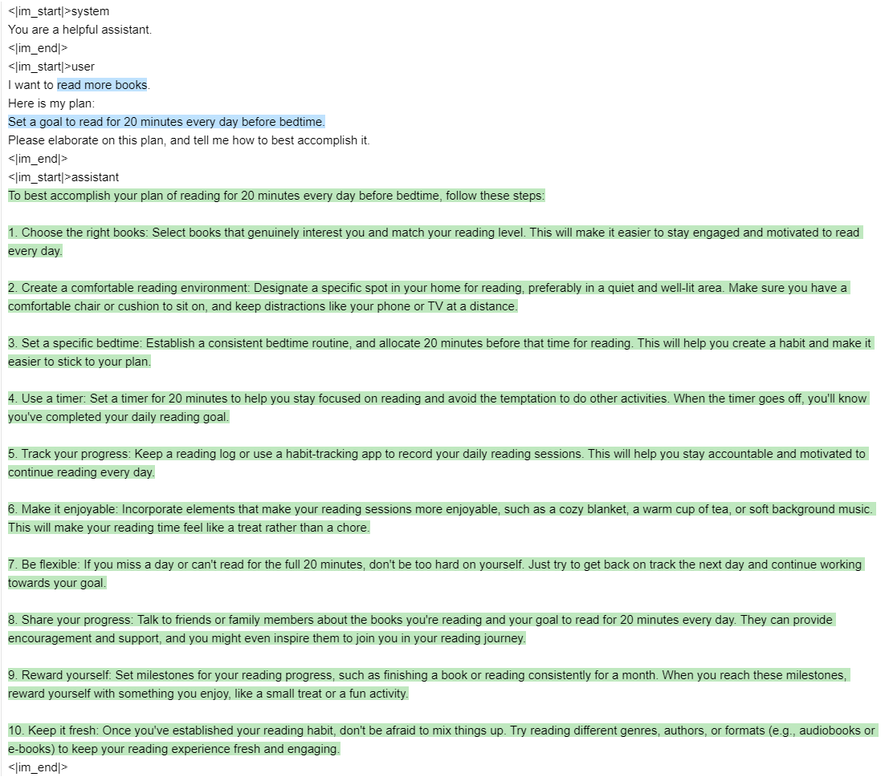

# Guidance

Guidance makes it easy to write prompts / programs to control language models with rich output structure.  
Simple output structure like [Chain of Thought](https://arxiv.org/abs/2201.11903) and its many variants (e.g. with [ART](https://arxiv.org/abs/2303.09014),) has been shown to improve LLM performance.  
The advent of more powerful LLMs like [GPT-4](https://arxiv.org/abs/2303.12712) allows for even richer output structure, and `guidance` makes that structure easier and cheaper.

Features:
- [x] Simple, intuitive syntax, using [handlebars](https://handlebarsjs.com/) templating
- [x] Rich output structure with multiple generations, selections, conditionals, tool use, etc
- [x] Playground-like streaming in jupyter notebook
- [x] Caching of generations for speedup
- [x] Support for [OpenAI's Chat models](https://beta.openai.com/docs/guides/chat)
- [x] Easy integration with huggingface models, with speedups due to zero-entropy segment optimization

# Install

```python
pip install guidance
```

# Quick demos
## Simple output structure
Let's take [a simple task](https://github.com/google/BIG-bench/tree/main/bigbench/benchmark_tasks/anachronisms) from BigBench, where the goal is to identify whether a given sentence contains an anachronism.  
Here is a simple two-shot prompt for it, with a human-crafted chain-of-thought sequence:
```python
import guidance
guidance.llm = guidance.llms.OpenAI("text-davinci-003") 
instruction = 'Given a sentence tell me whether it contains an anachronism (i.e. whether it could have happened or not based on the time periods associated with the entities).'
examples = [
    {'input': 'I wrote about shakespeare',
    'entities': [{'entity': 'I', 'time': 'present'}, {'entity': 'Shakespeare', 'time': '16th century'}],
    'reasoning': 'I can write about Shakespeare because he lived in the past with respect to me.',
    'answer': 'No'},
    {'input': 'Shakespeare wrote about me',
    'entities': [{'entity': 'Shakespeare', 'time': '16th century'}, {'entity': 'I', 'time': 'present'}],
    'reasoning': 'Shakespeare cannot have written about me, because he died before I was born',
    'answer': 'Yes'}
    ]
structure_prompt = guidance(
'''{{instruction}}
----
{{~! Few shot examples here ~}}
{{~#each examples}}
Sentence: {{this.input}}
Entities and dates:{{#each this.entities}}
{{this.entity}}: {{this.time}}{{/each}}
Reasoning: {{this.reasoning}}
Anachronism: {{this.answer}}
---
{{~/each}}
{{~! Input example here}}
Sentence: {{input}}
Entities and dates:
{{gen "entities"}}
Reasoning:{{gen "reasoning"}}
Anachronism:{{#select "answer"}} Yes{{or}} No{{/select}}''')
structure_prompt(examples=examples, input='The T-rex bit my dog', instruction=instruction)
```


We [compute accuracy](notebooks/anachronism.ipynb) on the validation set, and compare it to using the same two-shot examples above **without** the output structure, as well as to the best reported result [here](https://github.com/google/BIG-bench/tree/main/bigbench/benchmark_tasks/anachronisms). The results below agree with existing literature, in that even a very simple output structure drastically improves performance, even compared against much larger models.
| Model | Accuracy |
| :---: | :---: |
| [Few-shot learning with guidance examples, no CoT output structure](notebooks/anachronism.ipynb) | 63.04% |
| [PALM (3-shot)](https://github.com/google/BIG-bench/tree/main/bigbench/benchmark_tasks/anachronisms) | Around 69% |
| [Guidance](notebooks/anachronism.ipynb) | **76.01%** |


## Output structure with OpenAI's Chat models
Full notebook [here](notebooks/chat_topk.ipynb)
```python
import guidance
import re

guidance.llm = guidance.llms.OpenAI("gpt-4", chat_completion=True)

def parse_best(prosandcons, options):
    best = int(re.findall(r'Best=(\d+)', prosandcons)[0])
    return options[best]

create_plan = guidance('''<|im_start|>system
You are a helpful assistant.
<|im_end|>
<|im_start|>user
I want to {{goal}}.

{{~! generate potential options ~}}
{{#block hidden=True}}
Can you please generate one option for how to accomplish this?
Please make the option very short, at most one line.
<|im_end|>
<|im_start|>assistant
{{gen 'options' n=5 temperature=1.0 max_tokens=500}}
<|im_end|>
{{/block}}

{{~! generate pros and cons and select the best option ~}}
{{#block hidden=True}}
Can you please comment on the pros and cons of each of the following options, and then pick the best option?
---{{#each options}}
Option {{@index}}: {{this}}{{/each}}
---
Please discuss each option very briefly (one line for pros, one for cons), and end by saying Best=X, where X is the best option.
<|im_end|>
<|im_start|>assistant
{{gen 'prosandcons' temperature=0.0 max_tokens=500}}
<|im_end|>
{{/block}}

{{~! Create a plan }}
Here is my plan:
{{parse_best prosandcons options}}
Please elaborate on this plan, and tell me how to best accomplish it.
<|im_end|>
<|im_start|>assistant
{{gen 'plan' max_tokens=500}}
<|im_end|>''')
out = create_plan(goal='read more books', parse_best=parse_best)
```

This prompt is a bit more complicated, but we are basically going through 3 steps:
1. Generate a few options for how to accomplish the goal. Note that we generate with `n=5`, such that each option is a separate generation (and is not impacted by the other options). We set `temperature=1` to encourage diversity.
2. Generate pros and cons for each option, and select the best one. We set `temperature=0` to encourage the model to be more precise.
3. Generate a plan for the best option, and ask the model to elaborate on it. Notice that steps 1 and 2 were `hidden`, and thus GPT-4 does not see them. This is a simple way to make the model focus on the current step.

Since steps 1 and 2 are hidden, they do not appear on the generated output, but we can print them:
```python
print('\n'.join(['Option %d: %s' % (i, x) for i, x in enumerate(out['options'])]))
```
> Option 0: Set a goal to read for 20 minutes every day before bedtime.  
Option 1: Join a book club for increased motivation and accountability.  
Option 2: Set a daily goal to read for 20 minutes.  
Option 3: Set a daily reminder to read for at least 20 minutes.  
Option 4: Set a daily goal to read at least one chapter or 20 pages.  

```python
print(out['prosandcons'])
``` 

> Option 0:  
> Pros: Establishes a consistent reading routine.  
> Cons: May not be suitable for those with varying schedules.  
> \---  
> Option 1:  
> Pros: Provides social motivation and accountability.  
> Cons: May not align with personal reading preferences.  
> \---  
> Option 2:  
> Pros: Encourages daily reading habit.  
> Cons: Lacks a specific time frame, which may lead to procrastination.  
> \---  
> Option 3:  
> Pros: Acts as a daily reminder to prioritize reading.  
> Cons: May become repetitive and easy to ignore.  
> \---  
> Option 4:  
> Pros: Sets a clear daily reading target.  
> Cons: May be difficult to achieve on busy days or with longer chapters.  
>   
> Best=0  

Here is the final output:
```python
out
```

