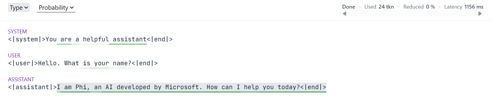
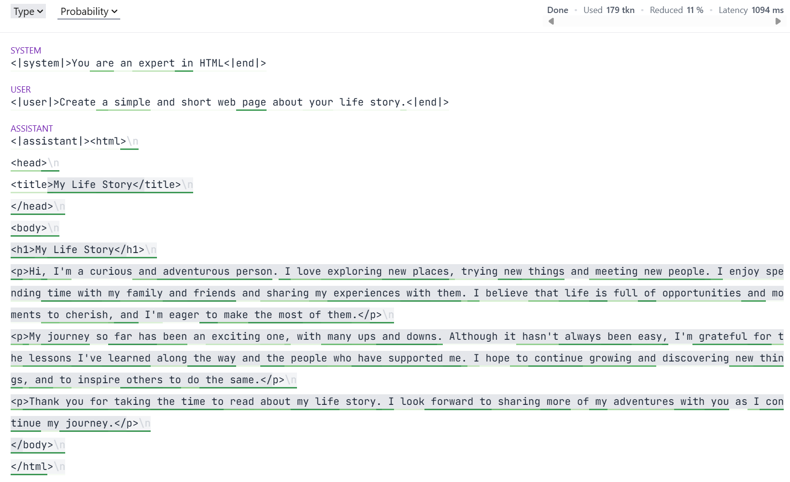

<div align="right"></div>
<div align="center"><picture>
  <source media="(prefers-color-scheme: dark)" srcset="docs/figures/guidance_logo_blue_dark.svg">
  
</picture></div>
<br/>

**Guidance is an efficient programming paradigm for steering language models.** With Guidance, you can control how output is structured and get high-quality output for your use case—*while reducing latency and cost vs. conventional prompting or fine-tuning.* It allows users to constrain generation (e.g. with regex and CFGs) as well as to interleave control (conditionals, loops, tool use) and generation seamlessly.

   * [Install](#install)
   * [Features](#features)


## Install
Guidance is available through PyPI and supports a variety of backends (Transformers, llama.cpp, OpenAI, etc.).
If you already have the backend required for your model, you can simply run
```bash
pip install guidance
```

## Features

### A Pythonic interface for language models

When using Guidance, you can work with large language models using common Python idioms:

```python
from guidance import system, user, assistant, gen
from guidance.models import Transformers

# Could also do LlamaCpp or many other models
phi_lm = Transformers("microsoft/Phi-4-mini-instruct")

# Model objects are immutable, so this is a copy
lm = phi_lm

with system():
    lm += "You are a helpful assistant"

with user():
    lm += "Hello. What is your name?"

with assistant():
    lm += gen(max_tokens=20)

print(lm)
```
If run at the command line, this will produce output like:
```
<|system|>You are a helpful assistant<|end|><|user|>Hello. What is your name?<|end|><|assistant|>I am Phi, an AI developed by Microsoft. How can I help you today?
```
However, if running in a Jupyter notebook, then Guidance provides a widget for a richer user experience:



With Guidance, it's really easy to capture generated text:

```python
# Get a new copy of the Model
lm = phi_lm

with system():
    lm += "You are a helpful assistant"

with user():
    lm += "Hello. What is your name?"

with assistant():
    lm += gen(name="lm_response", max_tokens=20)

print(f"{lm['lm_response']=}")
```

```
lm['lm_response']='I am Phi, an AI developed by Microsoft. How can I help you today?'
```

### Guarantee output syntax with constrained generation

Guidance provides an easy to use, yet immensely powerful syntax for constraining the output of a language model.
For example, a `gen()` call can be constrained to match a regular expression:

```python
lm = phi_lm

with system():
    lm += "You are a teenager"

with user():
    lm += "How old are you?"

with assistant():
    lm += gen("lm_age", regex=r"\d+", temperature=0.8)

print(f"The language model is {lm['lm_age']} years old")
```

```
The language model is 13 years old
```

Often, we know that the output has to be an item from a list we know in advance.
Guidance provides a `select()` function for this scenario:

```python
from guidance import select

lm = phi_lm

with system():
    lm += "You are a geography expert"

with user():
    lm += """What is the capital of Sweden? Answer with the correct letter.

    A) Helsinki
    B) Reykjavík 
    C) Stockholm
    D) Oslo
    """

with assistant():
    lm += select(["A", "B", "C", "D"], name="model_selection")

print(f"The model selected {lm['model_selection']}")
```

```
The model selected C
```

The constraint system offered by Guidance is extremely powerful.
It can ensure that the output conforms to any context free grammar (so long as the backend LLM has full support for Guidance).
More on this below.

### Create your own Guidance functions

With Guidance, you can create your own Guidance functions which can interact with language models.
These are marked using the `@guidance` decorator.
Suppose we wanted to answer lots of multiple choice questions.
We could do something like the following:

```python
import guidance

from guidance.models import Model

ASCII_OFFSET = ord("a")

@guidance
def zero_shot_multiple_choice(
    language_model: Model,
    question: str,
    choices: list[str],
):
    with user():
        language_model += question + "\n"
        for i, choice in enumerate(choices):
            language_model += f"{chr(i+ASCII_OFFSET)} : {choice}\n"

    with assistant():
        language_model += select(
            [chr(i + ASCII_OFFSET) for i in range(len(choices))], name="string_choice"
        )

    return language_model
```
Now, define some questions:
```python
questions = [
    {
        "question" : "Which state has the northernmost capital?",
        "choices" : [
            "New South Wales",
            "Northern Territory",
            "Queensland",
            "South Australia",
            "Tasmania",
            "Victoria",
            "Western Australia",
        ],
        "answer" : 1,
    },
    {
        "question" : "Which of the following is venomous?",
        "choices" : [
            "Kangaroo",
            "Koala Bear",
            "Platypus",
        ],
        "answer" : 2,
    }
]
```
We can use our decorated function like `gen()` or `select()`.
The `language_model` argument will be filled in for us automatically:
```python
lm = phi_lm

with system():
    lm += "You are a student taking a multiple choice test."

for mcq in questions:
    lm_temp = lm + zero_shot_multiple_choice(question=mcq["question"], choices=mcq["choices"])
    converted_answer = ord(lm_temp["string_choice"]) - ASCII_OFFSET
    print(lm_temp)
    print(f"LM Answer: {converted_answer},  Correct Answer: {mcq['answer']}")
```

```
<|system|>You are a student taking a multiple choice test.<|end|><|user|>Which state has the northernmost capital?
a : New South Wales
b : Northern Territory
c : Queensland
d : South Australia
e : Tasmania
f : Victoria
g : Western Australia
<|end|><|assistant|>b
LM Answer: 1,  Correct Answer: 1
<|system|>You are a student taking a multiple choice test.<|end|><|user|>Which of the following is venomous?
a : Kangaroo
b : Koala Bear
c : Platypus
<|end|><|assistant|>c
LM Answer: 2,  Correct Answer: 2
```

Guidance functions can be composed, in order to construct a full context free grammar.
For example, we can create Guidance functions to build a simple HTML webpage (note that this is _not_ a full implementation of HTML).
We start with a simple function which will generate text which does not contain any HTML tags.
The function is marked as `stateless` to indicate that we intend to use it for composing a grammar:

```python
@guidance(stateless=True)
def _gen_text(lm: Model):
    return lm + gen(regex="[^<>]+") 
```

We can then use this function to generate text within an arbitrary HTML tag:
```python
@guidance(stateless=True)
def _gen_text_in_tag(lm: Model, tag: str):
    lm += f"<{tag}>"
    lm += _gen_text()
    lm += f"</{tag}>"
    return lm
```
Now, let us create the page header. As part of this, we need to generate a page title:
```python
@guidance(stateless=True)
def _gen_header(lm: Model):
    lm += "<head>\n"
    lm += _gen_text_in_tag("title") + "\n"
    lm += "</head>\n"
    return lm
```
The body of the HTML page is going to be filled with headings and paragraphs.
We can define a function to do each:
```python
from guidance.library import one_or_more

@guidance(stateless=True)
def _gen_heading(lm: Model):
    lm += select(
        options=[_gen_text_in_tag("h1"), _gen_text_in_tag("h2"), _gen_text_in_tag("h3")]
    )
    lm += "\n"
    return lm

@guidance(stateless=True)
def _gen_para(lm: Model):
    lm += "<p>"
    lm += one_or_more(
        select(
            options=[
                _gen_text(),
                _gen_text_in_tag("em"),
                _gen_text_in_tag("strong"),
                "<br />",
            ],
        )
    )
    lm += "</p>\n"
    return lm
```
Now, the function to define the body of the HTML itself:
```python
@guidance(stateless=True)
def _gen_body(lm: Model):
    lm += "<body>\n"
    lm += one_or_more(select(options=[_gen_heading(), one_or_more(_gen_para())]))
    lm += "</body>\n"
    return lm
```
Next, we come to the function which generates the complete HTML page.
We add the HTML start tag, then generate the header, then body, and then append the ending HTML tag:
```python
@guidance(stateless=True)
def _gen_html(lm: Model):
    lm += "<html>\n"
    lm += _gen_header()
    lm += _gen_body()
    lm += "</html>\n"
    return lm
```
Finally, we provide a user-friendly wrapper, which will allow us to:
- Set the temperature of the generation
- Capture the generated page from the Model object
```python
from guidance.library import capture, with_temperature

@guidance(stateless=True)
def make_html(
    lm,
    name: str | None = None,
    *,
    temperature: float = 0.0,
):
    return lm + capture(
        with_temperature(_gen_html(), temperature=temperature),
        name=name,
    )
```
Now, use this to generate a simple webpage:
```python
lm = phi_lm

with system():
    lm += "You are an expert in HTML"

with user():
    lm += "Create a simple and short web page about your life story."

with assistant():
    lm += make_html(name="html_text", temperature=0.7)
```

When running in a Jupyter Notebook so that the widget is active, we get the following output:



Note the varying highlighting of the generation.
This is showing another of Guidance's capabilities: fast-forwarding of tokens.
The constraints imposed by a grammar often mean that some tokens are known in advance.
Guidance doesn't need the model to generate these; instead it can insert them into the generation.
This saves forward passes through the model, and hence reduces GPU usage.
For example, in the above HTML generation, Guidance always knows the last opening tag.
If the last opened tag was `<h1>` (for example), then as soon as the model generates `</`, Guidance can fill in `h1>` without needing the model to perform a forward pass.

### Generating JSON

A JSON schema is actually a context free grammar, and hence it can be used to constrain an LLM using Guidance.
This is a common enough case that Guidance provides special support for it.
A quick sample, based on a Pydantic model:
```python
import json
from pydantic import BaseModel, Field

from guidance import json as gen_json

class BloodPressure(BaseModel):
    systolic: int = Field(gt=300, le=400)
    diastolic: int = Field(gt=0, le=20)
    location: str = Field(max_length=50)
    model_config = dict(extra="forbid")

lm = phi_lm

with system():
    lm += "You are a doctor taking a patient's blood pressure taken from their arm"

with user():
    lm += "Report the blood pressure"

with assistant():
    lm += gen_json(name="bp", schema=BloodPressure)

print(f"{lm['bp']=}")

# Use Python's JSON library
loaded_json = json.loads(lm["bp"])
print(json.dumps(loaded_json, indent=4))

# Use Pydantic
result = BloodPressure.model_validate_json(lm["bp"])
print(result.model_dump_json(indent=8))
```
```
lm['bp']='{"systolic": 301, "diastolic": 15, "location": "arm"}'
{
    "systolic": 301,
    "diastolic": 15,
    "location": "arm"
}
{
        "systolic": 301,
        "diastolic": 15,
        "location": "arm"
}
```
Note that the generated blood pressure is not one the model will have seen for a human.
When generating JSON, a substantial number of tokens can often be fast-forwarded, due to the structural constraints imposed by the schema.
