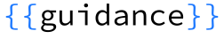

<div align="right"><a href="https://guidance.readthedocs.org"></a></div>
<div align="center"><picture>
  <source media="(prefers-color-scheme: dark)" srcset="docs/figures/guidance_logo_blue_dark.svg">
  
</picture></div>
<br/>


> *Note that v0.1 is a dramatically new version developed while releases had to be paused over the summer. If you are looking for the old version based on handlebars, you can use v0.0.64, but you should instead try porting over to the much better new version :)*

**`guidance`** is a programming paradigm that offers superior control and efficiency compared to conventional prompting and chaining. It allows users to constrain generation (e.g. with regex and CFGs) as well as to interleave control (conditional, loops) and generation seamlessly. Here are some important features: 

1. **Pure, beautiful python** with additional LM functionality. E.g. here is [basic generation](#basic-generation):
```python
from guidance import models, gen

# load a model (could be Transformers, LlamaCpp, VertexAI, OpenAI...)
llama2 = models.LlamaCpp(path) 

# append text or generations to the model
llama2 + f'Do you want a joke or a poem? ' + gen(stop='.')
```


2. [**Constrained generation**](#constrained-generation) with [selects](#select-basic), [regular expressions](#regular-expressions), and [context-free grammars](#context-free-grammars).
```python
from guidance import select

# a simple select between two options
llama2 + f'Do you want a joke or a poem? A ' + select(['joke', 'poem'])
```


3. **Rich templates with f-strings**:
```python
llama2 + f'''\
Do you want a joke or a poem? A {select(['joke', 'poem'])}.
Okay, here is a one-liner: "{gen(stop='"')}"
'''
```
<br>

4. [**Stateful control + generation**](#stateful-control--generation) makes it easy to interleave prompting / logic / generation, no need for intermediate parsers:
```python
# capture our selection under the name 'answer'
lm = llama2 + f"Do you want a joke or a poem? A {select(['joke', 'poem'], name='answer')}.\n"

# make a choice based on the model's previous selection
if lm["answer"] == "joke":
    lm += f"Here is a one-line joke about cats: " + gen('output', stop='\n')
else:
    lm += f"Here is a one-line poem about dogs: " + gen('output', stop='\n')
```
<br>


5. **Abstract chat interface** that uses the correct special tokens for any chat model:
```python
from guidance import user, assistant

# load a chat model
chat_lm = models.LlamaCppChat(path)

# wrap with chat block contexts
with user():
    lm = chat_lm + 'Do you want a joke or a poem?'

with assistant():
    lm += f"A {select(['joke', 'poem'])}."`
```
<br>

6. **Easy to write reusable components**
```python
@guidance
def one_line_thing(lm, thing, topic):
    lm += f'Here is a one-line {thing} about {topic}: ' + gen(stop='\n')
    return lm # return our updated model

# pick either a joke or a poem
lm = llama2 + f"Do you want a joke or a poem? A {select(['joke', 'poem'], name='thing')}.\n"

# call our guidance function
lm += one_line_thing(lm['thing'], 'cats')
```
<br>

7. **A library of pre-built components**, e.g. substring:
```python
from guidance import substring

# define a set of possible statements
text = 'guidance is awesome. guidance is so great. guidance is the best thing since sliced bread.'

# force the model to make an exact quote
llama2 + f'Here is a true statement about the guidance library: "{substring(text)}"'
```
<br>

8. [**Easy tool use**](#automatic-interleaving-of-control-and-generation-tool-use), where the model stops generation when a tool is called, calls the tool, then resumes generation. For example, here is a simple version of a calculator, via four separate 'tools':
```python
@guidance
def add(lm, input1, input2):
    lm += f' = {int(input1) + int(input2)}'
    return lm
@guidance
def subtract(lm, input1, input2):
    lm += f' = {int(input1) - int(input2)}'
    return lm
@guidance
def multiply(lm, input1, input2):
    lm += f' = {float(input1) * float(input2)}'
    return lm
@guidance
def divide(lm, input1, input2):
    lm += f' = {float(input1) / float(input2)}'
    return lm
```
Now we call `gen` with these tools as options. Notice how generation is stopped and restarted automatically:
```python
lm = llama2 + '''\
1 + 1 = add(1, 1) = 2
2 - 3 = subtract(2, 3) = -1
'''
lm + gen(max_tokens=15, tools=[add, subtract, multiply, divide])
```
<br>

9. **Speed**: In contrast to chaining, `guidance` programs are the equivalent of a single LLM call. More so, whatever non-generated text that gets appended is batched, so that `guidance` programs are **faster** than having the LM generate intermediate text when you have a set structure.

10. **Token healing**: Users deal with text (or bytes) rather than tokens, and thus don't have to worry about [perverse token boundaries issues](https://towardsdatascience.com/the-art-of-prompt-design-prompt-boundaries-and-token-healing-3b2448b0be38) such as 'prompt ending in whitespace'.

11. **Streaming support**, also integrated with jupyter notebooks:
```python
lm = llama2 + 'Here is a cute 5-line poem about cats and dogs:\n'
for i in range(5):
    lm += f"LINE {i+1}: " + gen(temperature=0.8, suffix="\n")
```


13. **High compatibility:** works with Transformers, llama.cpp, VertexAI, OpenAI. Users can write one guidance program and execute it on many backends. (note that the most powerful control features require endpoint integration, and for now work best with Transformers and llama.cpp).
```python
gpt = models.OpenAI("gpt-3.5-turbo")

with user():
    lm = gpt + "What is the capital of France?"

with assistant():
    lm += gen("capital")

with user():
    lm += "What is one short surprising fact about it?"

with assistant():
    lm += gen("fact")
```


## Table of Contents
   * [Install](#install)
   * [Loading models](#loading-models)
      * [llama.cpp](#llamacpp)
      * [transformers](#transformers)
      * [Vertex](#vertex-ai)
      * [OpenAI](#openai)
   * [Example notebooks](#example-notebooks)
   * [Basic generation](#basic-generation)
   * [Constrained Generation](#constrained-generation)
      * [Select (basic)](#select-basic)
      * [Regular expressions](#regular-expressions)
         * [Regex to constrain generation](#regex-to-constrain-generation)
         * [Regex as stopping criterion](#regex-as-stopping-criterion)
      * [Context-free grammars](#context-free-grammars)
   * [Stateful control + generation](#stateful-control--generation)
      * [State in immutable objects](#state-in-immutable-objects)
      * [Stateful guidance functions](#stateful-guidance-functions)
      * [Example: ReAct](#example-react)
      * [Example: Changing intermediate step of a Chat session](#example-changing-intermediate-step-of-a-chat-session)
      * [Automatic interleaving of control and generation: tool use](#automatic-interleaving-of-control-and-generation-tool-use)
      * [Gsm8k example](#gsm8k-example)
      * [Automatic call grammar for @guidance functions](#automatic-call-grammar-for-guidance-functions)
   * [Text, not tokens](#text-not-tokens)
   * [Fast](#fast)
      * [Integrated stateful control is faster](#integrated-stateful-control-is-faster)
      * [Guidance acceleration](#guidance-acceleration)

## Install
```bash
pip install guidance
```
## Loading models
### llama.cpp
Install the python bindings:
```bash
CMAKE_ARGS="-DLLAMA_CUBLAS=on" pip install llama-cpp-python
```
Loading the model:
```python
from guidance import models
lm = models.LlamaCpp(path_to_model, n_gpu_layers=-1)
```

### Transformers
Install transformers:
```python
from guidance import models
lm = models.Transformers(model_name_or_path)
```

### Vertex AI
Remote endpoints that don't have explicit guidance integration are run "optimistically". This means that all the text that can be forced is given to the model as a prompt (or chat context) and then the model is run in streaming mode without hard constrants (since the remote API doesn't support them). If the model ever violates the contraints then the model stream is stopped and we optionally try it again at that point. This means that all the API-supported control work as expected, and more complex controls/parsing that is not supported by the API work if the model stays consistent with the program.
```python
palm2 = models.VertexAI("text-bison@001")

with instruction():
    lm = palm2 + "What is one funny fact about Seattle?"

lm + gen("fact", max_tokens=100)
```
<br>

### OpenAI
OpenAI endpoint don't have direct support for guidance grammars, but through optimistic running we can still control them in ways that match the model type:

*Legacy completion models:*
```python
curie = models.OpenAI("text-curie-001")

curie + "The smallest cats are" + gen(stop=".")
```
<br>

*Instruct tuned models:*
```python
gpt_instruct = models.OpenAI("gpt-3.5-turbo-instruct")

with instruction():
    lm = gpt_instruct + "What are the smallest cats?"
    
lm += gen(stop=".")
```
<br>

*Chat models:*
```python
gpt = models.OpenAI("gpt-3.5-turbo")

with system():
    lm = gpt + "You are a cat expert."

with user():
    lm += "What are the smallest cats?"

with assistant():
    lm += gen("answer", stop=".")
```
<br>


## Example notebooks
We are working on updating our example notebooks. The following ones have been updated:
- [Basic tutorial](notebooks/tutorial.ipynb)
- [Chatbot with search](notebooks/chat_with_search.ipynb)  

More coming soon

## Basic generation
An `lm` object is immutable, so you change it by creating new copies of it. By default, when you append things to `lm`, it creates a copy, e.g.:
```python
from guidance import models, gen, select
llama2 = models.LlamaCpp(model)

# llama2 is not modified, `lm` is a copy of `llama2` with 'This is a prompt' appended to its state
lm = llama2 + 'This is a prompt'
```
<br>

You can append _generation_ calls to model objects, e.g.
```python
lm = llama2 + 'This is a prompt' + gen(max_tokens=10)
```
<br>

You can also interleave generation calls with plain text, or control flows:
```python
# Note how we set stop tokens
lm = llama2 + 'I like to play with my ' + gen(stop=' ') + ' in' + gen(stop=['\n', '.', '!'])
```
<br>

## Constrained Generation
### Select (basic)
`select` constrains generation to a set of options:
```python
lm = llama2 + 'I like the color ' + select(['red', 'blue', 'green'])
```
<br>

### Regular expressions
`gen` has optional arguments `regex` and `stop_regex`, which allow generation (and stopping, respectively) to be controlled by a regex. 

#### Regex to constrain generation
Unconstrained:

```python
lm = llama2 + 'Question: Luke has ten balls. He gives three to his brother.\n'
lm += 'How many balls does he have left?\n'
lm += 'Answer: ' + gen(stop='\n')
```
<br>

Constrained by regex:

```python
lm = llama2 + 'Question: Luke has ten balls. He gives three to his brother.\n'
lm += 'How many balls does he have left?\n'
lm += 'Answer: ' + gen(regex='\d+')
```
<br>


#### Regex as stopping criterion
Unconstrained:
```python
lm = llama2 + '19, 18,' + gen(max_tokens=50)
```
<br>

Stop with traditional stop text, whenever the model generates the number 7:
```python
lm = llama2 + '19, 18,' + gen(max_tokens=50, stop='7')
```
<br>

 
Stop whenever the model generates the character `7` without any numbers around it: 
```python
lm = llama2 + '19, 18,' + gen(max_tokens=50, stop_regex='[^\d]7[^\d]')
```
<br>


### Context-free grammars
We expose a variety of operators that make it easy to define CFGs, which in turn can be used to constrain generation.
For example, we can use the `select` operator (it accepts CFGs as options), `zero_or_more` and `one_or_more` to define a grammar for mathematical expressions:
```python
import guidance
from guidance import one_or_more, select, zero_or_more
# stateless=True indicates this function does not depend on LLM generations
@guidance(stateless=True)
def number(lm):
    n = one_or_more(select(['0', '1', '2', '3', '4', '5', '6', '7', '8', '9']))
    # Allow for negative or positive numbers
    return lm + select(['-' + n, n])

@guidance(stateless=True)
def operator(lm):
    return lm + select(['+' , '*', '**', '/', '-'])

@guidance(stateless=True)
def expression(lm):
    # Either
    # 1. A number (terminal)
    # 2. two expressions with an operator and optional whitespace
    # 3. An expression with parentheses around it
    return lm + select([
        number(),
        expression() + zero_or_more(' ') +  operator() + zero_or_more(' ') +  expression(),
        '(' + expression() + ')'
    ])
```

The `@guidance(stateless=True)` decorator makes it such that a function (e.g. `expression`) lives as a stateless grammar that does not get 'executed' until we call call `lm + expression()` or `lm += expression()`. For example, here is an example of _unconstrained_ generation:
```python
# Without constraints
lm = llama2 + 'Problem: Luke has a hundred and six balls. He then loses thirty six.\n'
lm += 'Equivalent arithmetic expression: ' + gen(stop='\n') + '\n'
```
<br>

Notice how the model wrote the right equation but solved it (incorrectly). If we wanted to constrain the model such that it only writes valid expressions (without trying to solve them), we can just append our grammar to it:
```python
grammar = expression()
lm = llama2 + 'Problem: Luke has a hundred and six balls. He then loses thirty six.\n'
lm += 'Equivalent arithmetic expression: ' + grammar + '\n'
```
<br>

Grammars are very easy to compose. For example, let's say we want a grammar that generates either a mathematical expression or an expression followed by a solution followed by another expression. Creating this grammar is easy:

```python
from guidance import regex
grammar = select([expression(), expression() +  regex(' = \d+; ') + expression()])
```
We can generate according to it:
```python
llama2 + 'Here is a math expression for two plus two: ' + grammar
```
<br>

```python
llama2 + '2 + 2 = 4; 3+3\n' + grammar
```
<br>

Even if you don't like thinking in terms of recursive grammars, this formalism makes it easy to constrain generation. For example, let's say we have the following one-shot prompt:
```python
@guidance(stateless=True)
def ner_instruction(lm, input):
    lm += f'''\
    Please tag each word in the input with PER, ORG, LOC, or nothing
    ---
    Input: John worked at Apple.
    Output:
    John: PER
    worked: 
    at: 
    Apple: ORG
    .: 
    ---
    Input: {input}
    Output:
    '''
    return lm
input = 'Julia never went to Morocco in her life!!'
llama2 + ner_instruction(input) + gen(stop='---')
```
<br>

Notice that the model did not spell the word 'Morocco' correctly. Sometimes the model might also hallucinate a tag that doesn't exist. We can improve this by adding more few-shot examples, etc, but we can also constrain generation to the exact format we want:
```python
import re

@guidance(stateless=True)
def constrained_ner(lm, input):
    # Split into words
    words = [x for x in re.split('([^a-zA-Z0-9])', input) if x and not re.match('\s', x)]
    ret = ''
    for x in words:
        ret += x + ': ' + select(['PER', 'ORG', 'LOC', '']) + '\n'
    return lm + ret
llama2 + ner_instruction(input) + constrained_ner(input)
```


While `constrained_ner(input)` **is** a grammar that constrains the model generation, it _feels_ like you're just writing normal imperative python code with `+=` and `selects`.


## Stateful control + generation
### State in immutable objects
Whenever you do `lm + grammar` or `lm + gen`, `lm + select`, etc, you return a new lm object with additional state. For example:

```python
lm = llama2 + 'This is a prompt' + gen(name='test', max_tokens=10)
lm += select(['this', 'that'], name='test2')
lm['test'], lm['test2']
```
<br>

### Stateful `guidance` functions
The guidance decorator is `@guidance(stateless=False)` by default, meaning that a function with this decorator depends on the lm state to execute (either prior state or state generated within the function). For example:
```python
@guidance(stateless=False)
def test(lm):
    lm += 'Should I say "Scott"?\n' + select(['yes', 'no'], name='answer') + '\n'
    if lm['answer'] == 'yes':
        lm += 'Scott'
    else:
        lm += 'Not Scott'
    return lm
llama2 + test()
```
<br>


### Example: ReAct
A big advantage of stateful control is that you don't have to write any intermediate parsers, and adding follow-up 'prompting' is easy, even if the follow up depends on what the model generates.
For example, let's say we want to implement the first example of ReAct prompt in [this](https://www.promptingguide.ai/techniques/react), and let's say the valid acts are only 'Search' or 'Finish'. We might write it like this:
```python
@guidance
def react_prompt_example(lm, question, max_rounds=10):
    lm += f'Question: {question}\n'
    i = 1
    while True:
        lm += f'Thought {i}: ' + gen(suffix='\n')
        lm += f'Act {i}: ' + select(['Search', 'Finish'], name='act') 
        lm += '[' + gen(name='arg', suffix=']') + '\n'
        if lm['act'] == 'Finish' or i == max_rounds:
            break
        else:
            lm += f'Observation {i}: ' + search(lm['arg']) + '\n'
        i += 1
    return lm
```
Notice how we don't have to write a parser for Act and argument and hope that the model generates something valid: we enforce it. Notice also that the loop only stops once the model chooses to act with 'Finish' (or once we hit a maximum number of rounds).

### Example: Changing intermediate step of a Chat session
We can also hide or change some of what the model generates. For example, below we get a Chat model (notice we use special `role` blocks) to name some experts to answer a question, but we always remove 'Ferriss' from the list if he is mentioned:
```python
from guidance import user, system, assistant
lm = llama2
query = 'How can I be more productive?'
with system():
    lm += 'You are a helpful and terse assistant.'
with user():
    lm += f'I want a response to the following question:\n{query}\n'
    lm += 'Name 3 world-class experts (past or present) who would be great at answering this.'
with assistant():
    temp_lm = lm
    for i in range(1, 4):
        # This regex only allows strings that look like names (where every word is capitalized)
        # list_append appends the result to a list
        temp_lm += f'{i}. ' + gen(regex='([A-Z][a-z]*\s*)+', suffix='\n',
                                  name='experts', list_append=True)
    experts = [x for x in temp_lm['experts'] if 'Ferriss' not in x]
    # Notice that even if the model generates 'Ferriss' above,
    # it doesn't get added to `lm`, only to `temp_lm`
    lm += ', '.join(experts)
with user():
    lm += 'Please answer the question as if these experts had collaborated in writing an anonymous answer.'
with assistant():
    lm += gen(max_tokens=100)
```
<br>

### Automatic interleaving of control and generation: tool use
Tool use is a common case of stateful control. To make it easy to do so, `gen` calls take `tools` as an optional argument, where each tool is defined by (1) a grammar that triggers its call and captures the arguments (if any), and (2) the actual tool call. Then, as generation unrolls, whenever the model generates something that matches the grammar of a tool call, it (1) stops generation, (2) calls the tool (which can append whatever it wants to the LM session), and (3) continues generation.

For example, here is how we might implement a calculator tool, leveraging our `expression` grammar above:
```python
from guidance import capture, Tool
@guidance(stateless=True)
def calculator_call(lm):
    # capture just 'names' the expression, to be saved in the LM state
    return lm + 'calculator(' + capture(expression(), 'tool_args') + ')'

@guidance
def calculator(lm):
    expression = lm['tool_args']
    # You typically don't want to run eval directly for save reasons
    # Here we are guaranteed to only have mathematical expressions
    lm += f' = {eval(expression)}'
    return lm
calculator_tool = Tool(calculator_call(), calculator)
lm = llama2 + 'Here are five expressions:\ncalculator(3 *3) = 33\ncalculator(2 + 1 * 3) = 5\n'
lm += gen(max_tokens=30, tools=[calculator_tool], stop='\n\n')
```
<br>


### Gsm8k example
Notice that the calculator is just called seamlessly during generation. Here is a more realistic exampe of the model solving a gsm8k question:

```python
@guidance
def math_with_calc(lm, question):
    # Two-shot example
    lm += '''\
    Question: John starts with 2 balls. He then quintupled his number of balls. Then he lost half of them. He then gave 3 to his brother. How many does he have left?
    Reasoning:
    1. He quintupled his balls. So he has calculator(2 * 5) = 10 balls.
    1. He lost half. So he has calculator(10 / 2) = 5 balls.
    3. He gave 3 to his brother. So he has calculator(5 - 3) = 2 balls.
    Answer: 2

    Question: Jill get 7 dollars a day in allowance. She uses 1 each day to by a bus pass, then gives half away. How much does she have left each day?
    Reasoning:
    1. She gets 7 dollars a day.
    1. She spends 1 on a bus pass. So she has calculator(5 - 1) = 6.
    3. She gives half away. So that makes calculator(6 / 2) = 3.
    Answer: 3

    '''
    lm += f'Question: {question}\n'
    lm += 'Reasoning:\n' + gen(max_tokens=200, tools=[calculator_tool], stop='Answer')
    # Only numbers or commas
    lm += 'Answer: ' + gen(regex='[-\d,]+')
    return lm

question = '''Janet’s ducks lay 16 eggs per day. She eats three for breakfast every morning and bakes muffins for her friends every day with four. She sells the remainder at the farmers' market daily for $2 per fresh duck egg. How much in dollars does she make every day at the farmers' market?'''
llama2 + math_with_calc(question)
```
<br>

### Automatic call grammar for @guidance functions
You can also initialize a `Tool` with any `@guidance`-decorated function, and the default call grammar will be like a python call. Here is an example of using multiple such tools in the same `gen` call:
```python
@guidance
def say_scott(lm, n):
    lm += '\n'
    for _ in range(int(n)):
        lm += 'Scott\n'
    return lm

@guidance
def say_marco(lm, n):
    lm += '\n'
    for _ in range(int(n)):
        lm += 'marco\n'
    return lm

tools = [Tool(callable=say_scott), Tool(callable=say_marco)]
llama2 + '''\
I am going to call say_scott and say_marco a few times:
say_scott(1)
Scott
''' + gen(max_tokens=20, tools=tools)
```
<br>


## Text, not tokens
The standard greedy tokenizations used by most language models introduce a variety of subtle and powerful biases, which that can have all kinds of unintended consequences for your prompts.
For example, take the following prompt, given to gpt-2 (standard greedy tokenization):

hf_gen(prompt, max_tokens=10)
```python
from transformers import pipeline
pipe = pipeline("text-generation", model="gpt2")
def hf_gen(prompt, max_tokens=100):
    return pipe(prompt, do_sample=False, max_length=max_tokens, return_full_text=False)[0]['generated_text']

prompt = 'http:'
hf_gen(prompt, max_tokens=10)
```
<br>

 
 Notice how Note that the output generated by the LLM does not complete the URL with the obvious next characters (two forward slashes). It instead creates an invalid URL string with a space in the middle. Why? Because the string `://` is its own token, and so once the model sees a colon by itself, it assumes that the next characters cannot be `//`; otherwise, the tokenizer would not have used `:`, and instead would have used `://`. This is why there are warnings about ending prompts in whitespace, but the problem is way more pervasive than that: any boundary that may span multiple tokens will cause problems, e.g. notice how a partial word causes incorrect completion:

 ```python
prompt = 'John is a'
hf_gen(prompt, max_tokens=5)
```
<br>


 ```python
prompt = 'John is a fo'
hf_gen(prompt, max_tokens=5)
```
<br>

While problematic enough for normal prompts, these problems would be a disaster in the kinds of prompts we wrote in this readme, where there is interleaving of prompting and generation happening multiple times (and thus multiple opportunities for problems). This is why `guidance` implements [token healing](https://towardsdatascience.com/the-art-of-prompt-design-prompt-boundaries-and-token-healing-3b2448b0be38), a feature that deals with prompt boundaries automatically, allowing users to just think in terms of **text** rather than tokens. For example:

```python
from guidance import models
gpt = models.Transformers('gpt2')
prompt = 'http:'
gpt + prompt + gen(max_tokens=10)
```
<br>


```python
prompt = 'John is a fo'
gpt + prompt + gen(max_tokens=2)
```
<br>

## Fast
### Integrated stateful control is faster
We have full control of the decoding loop in our integration with `transformers` and `llamacpp`, allowing us to add control and additional prompt without any extra cost.  
If instead we're calling a server, we pay the extra cost of making additional requests, which might be ok if the server has caching, but quickly becomes impractical if the server does not have fine-grained caching. For example, note again the output from the [gsm8k example with calculator](#gsm8k-example) above:


Every time we call `calculator`, we have to stop geneation, append the result to the prompt, and resume generation. To avoid slowing down after the first call, a server would need to keep the KV cache up to '3 for breakfast. So she has calculator(16 - 3)', then roll forward generation from that point on. Even servers that _do_ have caching often don't have a way to guarantee state is preserved at each stop and start, and so user's pay a significant overhead at each interruption. The normal approach of considering everything as a new prompt would cause significant slow downs every time `calculator` is called.

### Guidance acceleration
In addition to the benefit above, `guidance` calls are often **faster** than running equivalent prompts the traditional way, because we can batch any additional text that is added by the user as execution unrolls (rather than generating it). Take the example below, where we generate a json with a GGUF compressed `llama2` 7B executed using llama.cpp:
```python
@guidance
def character_maker(lm, id, description, valid_weapons):
    lm += f"""\
    The following is a character profile for an RPG game in JSON format.
    ```json
    {{
        "id": "{id}",
        "description": "{description}",
        "name": "{gen('name', stop='"')}",
        "age": {gen('age', regex='[0-9]+', stop=',')},
        "armor": "{select(options=['leather', 'chainmail', 'plate'], name='armor')}",
        "weapon": "{select(options=valid_weapons, name='weapon')}",
        "class": "{gen('class', stop='"')}",
        "mantra": "{gen('mantra', stop='"')}",
        "strength": {gen('strength', regex='[0-9]+', stop=',')},
        "items": ["{gen('item', list_append=True, stop='"')}", "{gen('item', list_append=True, stop='"')}", "{gen('item', list_append=True, stop='"')}"]
    }}```"""
    return lm
a = time.time()
lm = llama2 + character_maker(1, 'A nimble fighter', ['axe', 'sword', 'bow'])
time.time() - a
```
<br>

Everything that is not green is not actually generated by the model, and is thus batched (much faster). This prompt takes about 1.2 seconds on an A100 GPU. Now, if we let the model generate everything (as in the roughly equivalent prompt below), it takes roughly `2.6` seconds (not only is it slower, we also have less control over generation). 
```python
@guidance
def character_maker2(lm, id, description):
    lm += f"""\
    The following is a character profile for an RPG game in JSON format. It has fields 'id', 'description', 'name', 'age', 'armor', weapon', 'class', 'mantra', 'strength', and 'items (just the names of 3 items)'
    please set description to '{description}'
    ```json""" + gen(stop='```')
    return lm
a = time.time()
lm = llama2 + character_maker2(1, 'A nimble fighter')
time.time() - a
```
<br>

