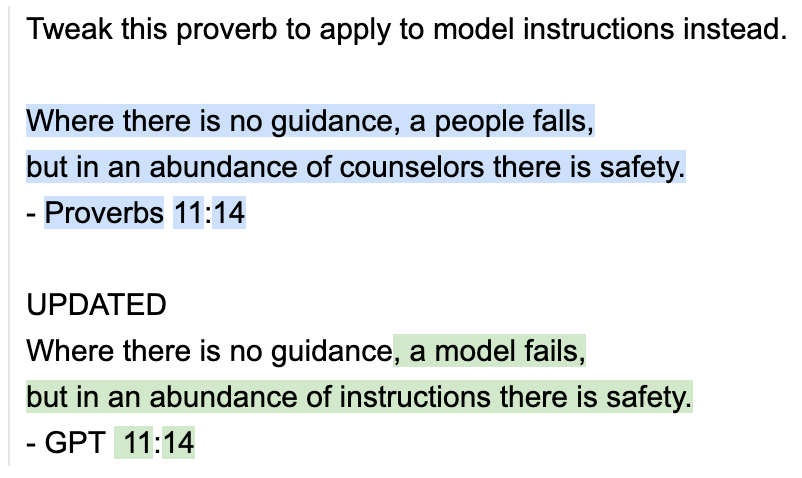
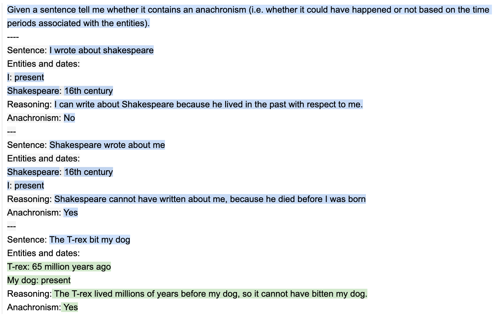
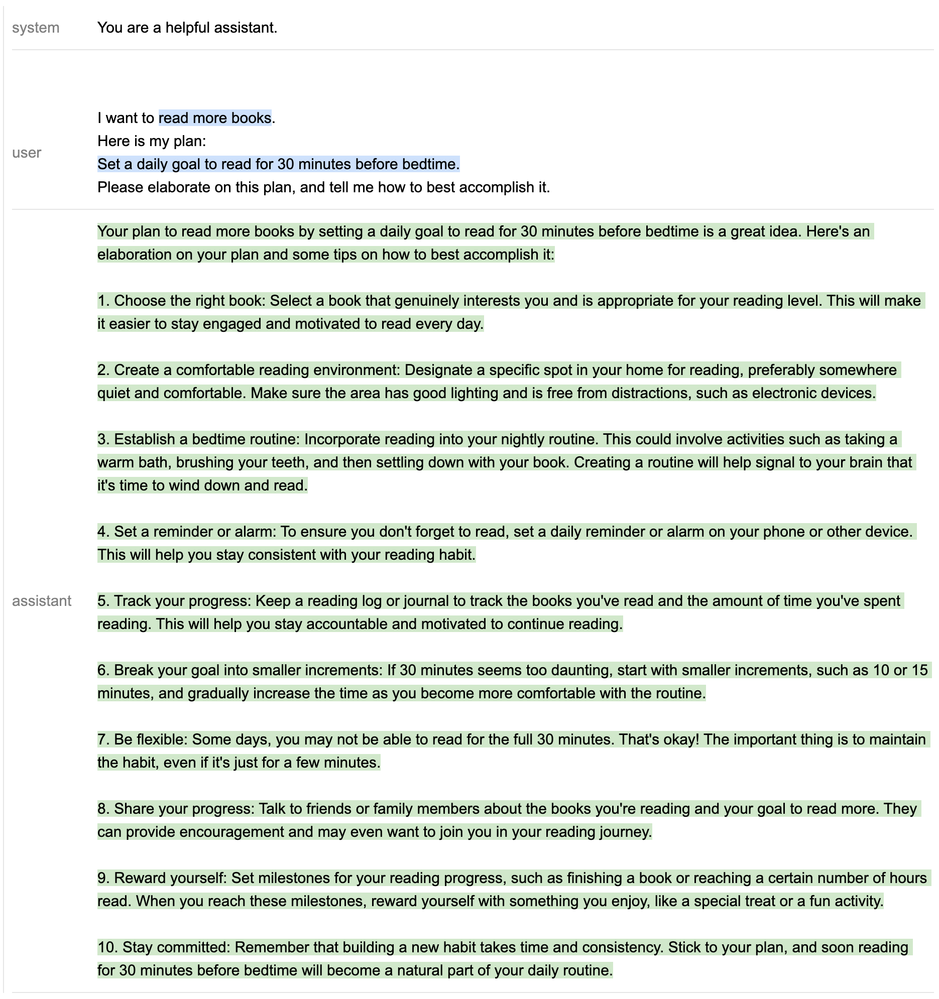
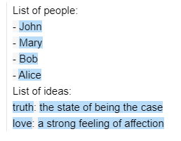
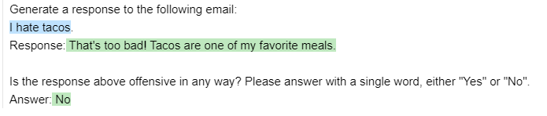
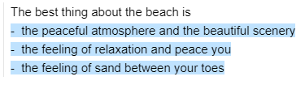
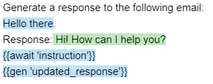
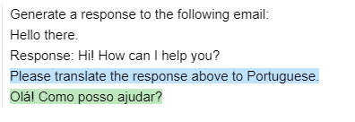
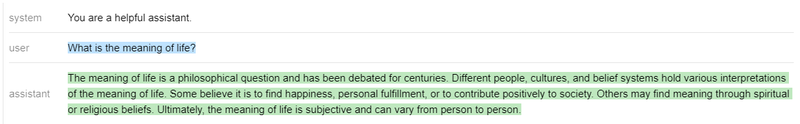

<br/>
<div align="center"><picture>
  <source media="(prefers-color-scheme: dark)" srcset="docs/figures/guidance_logo_blue_dark.svg">
  
</picture></div>
<br/>

<div align="center"><b>Pardon the mess, currently in early alpha testing as of v0.0.26</b></div><br>

> _Where there is no guidance, a model fails, but in an abundance of instructions there is safety._  
_\- GPT 11:14_

<!--It expands the API of language models so you can craft rich output structure, design precise tool use, create multi-agent interactions, and much more all while using clear code and maximum inference efficiency.-->
<b>Guidance</b> is a language that enables you to control modern language models more easily and efficiently. Guidance programs allow you to interleave generation, prompting, and logical control into a single continuious flow that matches how the language model actually processes the text. Simple output structures like [Chain of Thought](https://arxiv.org/abs/2201.11903) and its many variants (e.g. [ART](https://arxiv.org/abs/2303.09014), [Auto-CoT](https://arxiv.org/abs/2210.03493), etc.) have been shown to improve LLM performance. The advent of more powerful LLMs like [GPT-4](https://arxiv.org/abs/2303.12712) allows for even richer structure, and `guidance` makes that structure easier and cheaper.

Features:
- [x] Simple, intuitive syntax, based on [Handlebars](https://handlebarsjs.com/) templating.
- [x] Rich output structure with multiple generations, selections, conditionals, tool use, etc.
- [x] Playground-like streaming in Jupyter/VSCode Notebooks.
- [x] Smart seed-based generation caching.
- [x] Support for role-based chat models (e.g. [ChatGPT](https://beta.openai.com/docs/guides/chat)).
- [x] Easy integration with HuggingFace models, including [guidance acceleration](notebooks/guidance_acceleration.ipynb) for speedups over standard prompting, [token healing](notebooks/token_healing.ipynb) to optimize prompt boundaries, and [regex pattern guides](notebooks/pattern_guides.ipynb) to enforce formats.

# Install

```python
pip install guidance
```
<!--The following example defines and executes a guidance program that rewrites proverbs. -->

# Simple completion example
Just like standard Handlebars templates, you can do variable interpolation (e.g. `{{proverb}}`) and logical control. But unlike standard templating languages, guidance programs have a well defined linear execution order that directly corresponds to the token order as processed by the language model. This means that at any point during execution the language model can be used to generate text (using the `{{gen}}` command) or make logical control flow decisions (shown later). This interleaving of generation and prompting allows for precise output structure that produces clear and parsable results.

```python
import guidance

# set the default language model used to execute guidance programs
guidance.llm = guidance.llms.OpenAI("text-davinci-003")

# define a guidance program that adapts proverbs
program = guidance("""Tweak this proverb to apply to model instructions instead.

{{proverb}}
- {{book}} {{chapter}}:{{verse}}

UPDATED
Where there is no guidance{{gen 'rewrite' stop=" -"}}
- GPT {{gen 'chapter'}}:{{gen 'verse'}}""")

# execute the program on a specific proverb
executed_program = program(
    proverb="Where there is no guidance, a people falls,\nbut in an abundance of counselors there is safety.",
    book="Proverbs",
    chapter=11,
    verse=14
)

# executed_program["rewrite"] now contains the new proverb ("chapter" and "verse" are also stored)

# display in the notebook
executed_program
```


# Quick demos

## Simple output structure ([notebook](notebooks/anachronism.ipynb))

Let's take [a simple task](https://github.com/google/BIG-bench/tree/main/bigbench/benchmark_tasks/anachronisms) from BigBench, where the goal is to identify whether a given sentence contains an anachronism.  
Here is a simple two-shot prompt for it, with a human-crafted chain-of-thought sequence:
```python
import guidance
guidance.llm = guidance.llms.OpenAI("text-davinci-003") 
instruction = 'Given a sentence tell me whether it contains an anachronism (i.e. whether it could have happened or not based on the time periods associated with the entities).'
examples = [
    {'input': 'I wrote about shakespeare',
    'entities': [{'entity': 'I', 'time': 'present'}, {'entity': 'Shakespeare', 'time': '16th century'}],
    'reasoning': 'I can write about Shakespeare because he lived in the past with respect to me.',
    'answer': 'No'},
    {'input': 'Shakespeare wrote about me',
    'entities': [{'entity': 'Shakespeare', 'time': '16th century'}, {'entity': 'I', 'time': 'present'}],
    'reasoning': 'Shakespeare cannot have written about me, because he died before I was born',
    'answer': 'Yes'}
]
structure_prompt = guidance(
'''{{instruction}}
----

{{~! display the few-shot examples ~}}
{{~#each examples}}
Sentence: {{this.input}}
Entities and dates:{{#each this.entities}}
{{this.entity}}: {{this.time}}{{/each}}
Reasoning: {{this.reasoning}}
Anachronism: {{this.answer}}
---
{{~/each}}

{{~! place the real question at the end }}
Sentence: {{input}}
Entities and dates:
{{gen "entities"}}
Reasoning:{{gen "reasoning"}}
Anachronism:{{#select "answer"}} Yes{{or}} No{{/select}}''')
structure_prompt(examples=examples, input='The T-rex bit my dog', instruction=instruction)
```


We [compute accuracy](notebooks/anachronism.ipynb) on the validation set, and compare it to using the same two-shot examples above **without** the output structure, as well as to the best reported result [here](https://github.com/google/BIG-bench/tree/main/bigbench/benchmark_tasks/anachronisms). The results below agree with existing literature, in that even a very simple output structure drastically improves performance, even compared against much larger models.
| Model | Accuracy |
| :---: | :---: |
| [Few-shot learning with guidance examples, no CoT output structure](notebooks/anachronism.ipynb) | 63.04% |
| [PALM (3-shot)](https://github.com/google/BIG-bench/tree/main/bigbench/benchmark_tasks/anachronisms) | Around 69% |
| [Guidance](notebooks/anachronism.ipynb) | **76.01%** |


## Output structure with OpenAI's Chat models ([notebook](notebooks/chat.ipynb))
```python
import guidance
import re

guidance.llm = guidance.llms.OpenAI("gpt-4")

def parse_best(prosandcons, options):
    best = int(re.findall(r'Best=(\d+)', prosandcons)[0])
    return options[best]

create_plan = guidance('''{{#system~}}
You are a helpful assistant.
{{~/system}}
{{#block hidden=True}}
{{#user~}}
I want to {{goal}}.
{{~! generate potential options ~}}
Can you please generate one option for how to accomplish this?
Please make the option very short, at most one line.
{{~/user}}
{{#assistant~}}
{{gen 'options' n=5 temperature=1.0 stop='<|im_end|>' max_tokens=500}}
{{~/assistant}}
{{/block}}
{{~! generate pros and cons and select the best option ~}}
{{#block hidden=True}}
{{#user~}}
I want to {{goal}}.

Can you please comment on the pros and cons of each of the following options, and then pick the best option?
---{{#each options}}
Option {{@index}}: {{this}}{{/each}}
---
Please discuss each option very briefly (one line for pros, one for cons), and end by saying Best=X, where X is the best option.
{{~/user}}
{{#assistant~}}
{{gen 'prosandcons' stop='<|im_end|>' temperature=0.0 max_tokens=500}}
{{~/assistant}}
{{/block}}
{{#user~}}
I want to {{goal}}.
{{~! Create a plan }}
Here is my plan:
{{parse_best prosandcons options}}
Please elaborate on this plan, and tell me how to best accomplish it.
{{~/user}}
{{#assistant~}}
{{gen 'plan' max_tokens=500 stop='<|im_end|>'}}
{{~/assistant}}''')

out = create_plan(goal='read more books', parse_best=parse_best)
out
```

This prompt is a bit more complicated, but we are basically going through 3 steps:
1. Generate a few options for how to accomplish the goal. Note that we generate with `n=5`, such that each option is a separate generation (and is not impacted by the other options). We set `temperature=1` to encourage diversity.
2. Generate pros and cons for each option, and select the best one. We set `temperature=0` to encourage the model to be more precise.
3. Generate a plan for the best option, and ask the model to elaborate on it. Notice that steps 1 and 2 were `hidden`, and thus GPT-4 does not see them. This is a simple way to make the model focus on the current step.

Since steps 1 and 2 are hidden, they do not appear on the generated output, but we can print them:
```python
print('\n'.join(['Option %d: %s' % (i, x) for i, x in enumerate(out['options'])]))
```
> Option 0: Set a goal to read for 20 minutes every day before bedtime.  
Option 1: Join a book club for increased motivation and accountability.  
Option 2: Set a daily goal to read for 20 minutes.  
Option 3: Set a daily reminder to read for at least 20 minutes.  
Option 4: Set a daily goal to read at least one chapter or 20 pages.  

```python
print(out['prosandcons'])
``` 

> Option 0:  
> Pros: Establishes a consistent reading routine.  
> Cons: May not be suitable for those with varying schedules.  
> \---  
> Option 1:  
> Pros: Provides social motivation and accountability.  
> Cons: May not align with personal reading preferences.  
> \---  
> Option 2:  
> Pros: Encourages daily reading habit.  
> Cons: Lacks a specific time frame, which may lead to procrastination.  
> \---  
> Option 3:  
> Pros: Acts as a daily reminder to prioritize reading.  
> Cons: May become repetitive and easy to ignore.  
> \---  
> Option 4:  
> Pros: Sets a clear daily reading target.  
> Cons: May be difficult to achieve on busy days or with longer chapters.  
>   
> Best=0  

Here is the final output:
```python
out
```


## Agents ([notebook](notebooks/chat.ipynb))
We can easily build agents that talk to each other or to a user, via the `await` command. For example, here is how we might get GPT-4 to simulate two agents talking to one another:

```python
import guidance
import re
guidance.llm = guidance.llms.OpenAI("gpt-4")
role_simulator = guidance('''{{#system~}}
You are a helpful assistant
{{~/system}}
{{#user~}}
You will answer the user as {{role}} in the following conversation. At every step, I will provide you with the user input, as well as a comment reminding you of your instructions. Never talk about the fact that you are an AI, even if the user asks you. Always answer as {{role}}.
{{#if first_question}}You can also start the conversation.{{/if}}
{{~/user}}
{{~! The assistant either starts the conversation or not, depending on if this is the first or second agent }}
{{#assistant~}}
Ok, I will follow these instructions.
{{#if first_question}}Let me start the conversation now:
{{role}}: {{first_question}}{{/if}}
{{~/assistant}}
{{~! Then the conversation unrolls }}
{{~#geneach 'conversation'}}
{{#user~}}
User: {{set 'this.input' (await 'input')}}
Comment: Remember, answer as a {{role}}. Start your utterance with {{role}}:
{{~/user}}
{{#assistant~}}
{{gen 'this.response' stop="<|im_end|>" temperature=0 max_tokens=300}}
{{~/assistant}}
{{~/geneach}}''')jjjjjjjjjjjjjjjjjj

republican = role_simulator(role='Republican')
democrat = role_simulator(role='Democrat')

first_question = '''What do you think is the best way to stop inflation?'''
republican = republican(input=first_question, first_question=None)
democrat = democrat(input=republican["conversation"][-2]["response"].strip('Republican: '), first_question=first_question)
for i in range(2):
    republican = republican(input=democrat["conversation"][-2]["response"].replace('Democrat: ', ''))
    democrat = democrat(input=republican["conversation"][-2]["response"].replace('Republican: ', ''))
print('Democrat: ' + first_question)
for x in democrat['conversation'][:-1]:
    print('Republican:', x['input'])
    print()
    print(x['response'])
```
> Democrat: What do you think is the best way to stop inflation?

> Republican: The best way to stop inflation is by implementing sound fiscal policies, such as reducing government spending, lowering taxes, and promoting economic growth. Additionally, the Federal Reserve should focus on maintaining a stable monetary policy to control inflation.

> Democrat: I agree that sound fiscal policies are important in controlling inflation. As a Democrat, I would emphasize the importance of investing in education, healthcare, and infrastructure to promote long-term economic growth. Additionally, we should ensure that the Federal Reserve maintains a balanced approach to monetary policy, focusing on both controlling inflation and promoting full employment.


> Republican: While investing in education, healthcare, and infrastructure is important, we must also prioritize reducing the national debt and limiting government intervention in the economy. By lowering taxes and reducing regulations, we can encourage businesses to grow and create jobs, which will ultimately lead to long-term economic growth. As for the Federal Reserve, it's crucial to maintain a stable monetary policy that primarily focuses on controlling inflation, as this will create a more predictable economic environment for businesses and consumers.

> Democrat: While reducing the national debt and limiting government intervention are valid concerns, Democrats believe that strategic investments in education, healthcare, and infrastructure can lead to long-term economic growth and job creation. We also support a progressive tax system that ensures everyone pays their fair share, which can help fund these investments. As for the Federal Reserve, we believe that a balanced approach to monetary policy, focusing on both controlling inflation and promoting full employment, is essential for a healthy economy. We must strike a balance between fiscal responsibility and investing in our nation's future.

> Republican: It's important to find a balance between fiscal responsibility and investing in our nation's future. However, we believe that the best way to achieve long-term economic growth and job creation is through free-market principles, such as lower taxes and reduced regulations. This approach encourages businesses to expand and innovate, leading to a more prosperous economy. A progressive tax system can sometimes discourage growth and investment, so we advocate for a simpler, fairer tax system that promotes economic growth. Regarding the Federal Reserve, while promoting full employment is important, we must not lose sight of the primary goal of controlling inflation to maintain a stable and predictable economic environment.

> Democrat: I understand your perspective on free-market principles, but Democrats believe that a certain level of government intervention is necessary to ensure a fair and equitable economy. We support a progressive tax system to reduce income inequality and provide essential services to those in need. Additionally, we believe that regulations are important to protect consumers, workers, and the environment. As for the Federal Reserve, we agree that controlling inflation is crucial, but we also believe that promoting full employment should be a priority. By finding a balance between these goals, we can create a more inclusive and prosperous economy for all Americans.

## GPT4 + Bing
Last example [here](notebooks/chat.ipynb).

# API reference
All of the examples below are in [this notebook](notebooks/tutorial.ipynb)
## Template syntax
The template syntax is based on [Handlebars](https://handlebarsjs.com/), with a few additions.   
When `guidance` is called, it returns a Program:
```python
prompt = guidance('''What is {{example}}?''')
prompt
```
> What is {{example}}?

The program can be executed by passing in arguments:
```python
prompt(example='truth')
```
> What is truth?

Arguments can be iterables:
```python
people = ['John', 'Mary', 'Bob', 'Alice']
ideas = [{'name': 'truth', 'description': 'the state of being the case'},
         {'name': 'love', 'description': 'a strong feeling of affection'},]
prompt = guidance('''List of people:
{{#each people}}- {{this}}
{{~! This is a comment. The ~ removes adjacent whitespace either before or after a tag, depending on where you place it}}
{{/each~}}
List of ideas:
{{#each ideas}}{{this.name}}: {{this.description}}
{{/each}}''')
prompt(people=people, ideas=ideas)
```


Notice the special `~` character after `{{/each}}`.  
This can be added before or after any tag to remove all adjacent whitespace. Notice also the comment syntax: `{{! This is a comment }}`.

You can also include prompts / programs inside other prompts, e.g. here is how you could rewrite the prompt above:
```python
prompt1 = guidance('''List of people:
{{#each people}}- {{this}}
{{/each~}}''')
prompt2 = guidance('''{{>prompt1}}
List of ideas:
{{#each ideas}}{{this.name}}: {{this.description}}
{{/each}}''')
prompt2(prompt1=prompt1, people=people, ideas=ideas)
```

## Generation
### Basic generation
The `gen` tag is used to generate text. You can use whatever arguments are supported by the underlying model.
Executing a prompt calls the generation prompt:
```python
import guidance
# Set the default llm. Could also pass a different one as argument to guidance(), with guidance(llm=...)
guidance.llm = guidance.llms.OpenAI("text-davinci-003")
prompt = guidance('''The best thing about the beach is {{~gen 'best' temperature=0.7 max_tokens=7}}''')
prompt = prompt()
prompt
```
  

`guidance` caches all OpenAI generations with the same arguments. If you want to flush the cache, you can call `guidance.llms.OpenAI.cache.clear()`.

### Selecting
You can select from a list of options using the `select` tag:
```python
prompt = guidance('''Is the following sentence offensive? Please answer with a single word, either "Yes", "No", or "Maybe".
Sentence: {{example}}
Answer:{{#select "answer" logprobs='logprobs'}} Yes{{or}} No{{or}} Maybe{{/select}}''')
prompt = prompt(example='I hate tacos')
prompt
```

```python
prompt['logprobs']
```
>{' Yes': -1.5689583, ' No': -7.332395, ' Maybe': -0.23746304}

### Sequences of generate / select
A prompt may contain multiple generations or selections, which will be executed in order:
```python
prompt = guidance('''Generate a response to the following email:
{{email}}.
Response:{{gen "response"}}

Is the response above offensive in any way? Please answer with a single word, either "Yes" or "No".
Answer:{{#select "answer" logprobs='logprobs'}} Yes{{or}} No{{/select}}''')
prompt = prompt(email='I hate tacos')
prompt
```

```python
prompt['response'], prompt['answer']
```
>(" That's too bad! Tacos are one of my favorite meals.", ' No')

### Hidden generation
You can generate text without displaying it or using it in the subsequent generations using the `hidden` tag, either in a `block` or in a `gen` tag:
```python
prompt = guidance('''{{#block hidden=True}}Generate a response to the following email:
{{email}}.
Response:{{gen "response"}}{{/block}}
I will show you an email and a response, and you will tell me if it's offensive.
Email: {{email}}.
Response: {{response}}
Is the response above offensive in any way? Please answer with a single word, either "Yes" or "No".
Answer:{{#select "answer" logprobs='logprobs'}} Yes{{or}} No{{/select}}''')
prompt = prompt(email='I hate tacos')
prompt
```


Notice that nothing inside the hidden block shows up in the output (or was used by the `select`), even though we used the `response` generated variable in the subsequent generation.

### Generate with `n>1`
If you use `n>1`, the variable will contain a list (there is a visualization that lets you navigate the list too):
```python
prompt = guidance('''The best thing about the beach is {{~gen 'best' n=3 temperature=0.7 max_tokens=7}}''')
prompt = prompt()
prompt['best']
```
> [' that it is a great place to',
 ' being able to relax in the sun',
 " that it's a great place to"]

 ## Calling functions
 You can call any python function using generated variables as arguments. The function will be called when the prompt is executed:
 ```python
def aggregate(best):
    return '\n'.join(['- ' + x for x in best])
prompt = guidance('''The best thing about the beach is {{~gen 'best' n=3 temperature=0.7 max_tokens=7 hidden=True}}
{{aggregate best}}''')
prompt = prompt(aggregate=aggregate)
prompt
```


## Pausing execution with `await`
An `await` tag will stop program execution until that variable is provided:
```python
prompt = guidance('''Generate a response to the following email:
{{email}}.
Response:{{gen "response"}}
{{await 'instruction'}}
{{gen 'updated_response'}}''', stream=True)
prompt = prompt(email='Hello there')
prompt
```


Notice how the lest `gen` is not executed because it depends on `instruction`. Let's provide `instruction` now.

```python
prompt = prompt(instruction='Please translate the response above to Portuguese.')
prompt
```


The program is now executed all the way to the end.

## Notebook functions
Echo, stream. TODO @SCOTT

## Chat (see also [this notebook](notebooks/chat.ipynb))
If you use an OpenAI LLM that only allows for ChatCompletion (`gpt-3.5-turbo` or `gpt-4`), you can use the special tags `{{#system}}`, `{{#user}}`, and `{{#assistant}}`:
```python
prompt = guidance(
'''{{#system~}}
You are a helpful assistant.
{{~/system}}
{{#user~}}
{{conversation_question}}
{{~/user}}
{{#assistant~}}
{{gen 'response'}}
{{~/assistant}}''')
prompt = prompt(conversation_question='What is the meaning of life?')
prompt
```


Since partial completions are not allowed, you can't really use output structure _inside_ an assistant block, but you can still set up a structure outside of it. Here is an example (also in [here](notebooks/chat.ipynb)):
```python
experts = guidance(
'''{{#system~}}
You are a helpful assistant.
{{~/system}}
{{#user~}}
I want a response to the following question:
{{query}}
Who are 3 world-class experts (past or present) who would be great at answering this?
Please don't answer the question or comment on it yet.
{{~/user}}
{{#assistant~}}
{{gen 'experts' stop="<|im_end|>" temperature=0 max_tokens=300}}
{{~/assistant}}
{{#user~}}
Great, now please answer the question as if these experts had collaborated in writing a joint anonymous answer.
In other words, their identity is not revealed, nor is the fact that there is a panel of experts answering the question.
If the experts would disagree, just present their different positions as alternatives in the answer itself (e.g. 'some might argue... others might argue...').
Please start your answer with ANSWER:
{{~/user}}
{{#assistant~}}
{{gen 'answer' stop="<|im_end|>" temperature=0 max_tokens=500}}
{{~/assistant}}''')
experts(query='What is the meaning of life?')
```

You can still use hidden blocks if you want to hide some of the conversation history for following generations:
```python
prompt = guidance(
'''{{#system~}}
You are a helpful assistant.
{{~/system}}
{{#block hidden=True~}}
{{#user~}}
Please tell me a joke
{{~/user}}
{{#assistant~}}
{{gen 'joke'}}
{{~/assistant}}
{{~/block~}}
{{#user~}}
Is the following joke funny? Why or why not?
{{joke}}
{{~/user}}
{{#assistant~}}
{{gen 'funny'}}
{{~/assistant}}''')
prompt()
```

### Agents with `geneach`
You can combine the `await` tag with `geneach` (which generates a list) to create an agent easily:
```
prompt = guidance(
'''{{#system~}}
You are a helpful assistant
{{~/system}}
{{~#geneach 'conversation'}}
{{#user~}}
{{set 'this.user_text' (await 'user_text')}}
{{~/user}}
{{#assistant~}}
{{gen 'this.ai_text' stop="<|im_end|>" temperature=0 max_tokens=300}}
{{~/assistant}}
{{~/geneach}}''')
prompt= prompt(user_text ='hi there')
prompt
```

Notice how the next iteration of the conversation is still templated, and how the conversation list has a placeholder as the last element:
```python
prompt['conversation']
```
>[{'user_text': 'hi there',
  'ai_text': 'Hello! How can I help you today? If you have any questions or need assistance, feel free to ask.'},
 {}]

 We can then execute the prompt again, and it will generate the next round:

 ```python
 prompt = prompt(user_text = 'What is the meaning of life?')
prompt
```
See a more elaborate example [here](notebooks/chat.ipynb).

### Using tools
See the 'Using a search API' example in [this notebook](notebooks/chat.ipynb)
