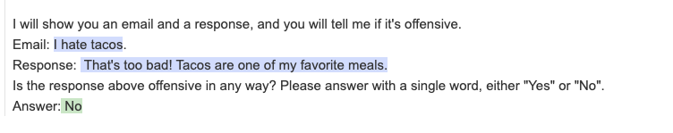

<div align="right"><a href="https://guidance.readthedocs.org"></a></div>
<div align="center"><picture>
  <source media="(prefers-color-scheme: dark)" srcset="docs/figures/guidance_logo_blue_dark.svg">
  
</picture></div>
<br/>

**`guidance`** is a programming paradigm that offers superior control and efficiency compared to conventional prompting and chaining. It features:

- [x] *[Stateful control + generation](test)*. Interleave generation, prompting, and logical control into a single continuous flow matching how the language model actually processes the text.
- [x] [Guidance grammars](test2). Control and parse model generations using a superset of traditional context free grammars that is tailored for generative control.
- [x] [Pure, beautiful, python](test2). Use lightweight immutable model objects, f-strings, and context blocks to cleanly define templates and programs in native python without ever worrying about separate "template code".
- [x] [Interactive development](test2). Develop with streaming playground-like interactivity while retaining the full power of python in standard Jupyter/VSCode/CoLab notebooks.
- [x] [Token healing](test2). Develop with streaming playground-like interactivity while retaining the full power of python in standard Jupyter/VSCode/CoLab notebooks.


Control and parse model generations using a superset of traditional context free grammars that is tailored for generative control.

Below is a toy example for discussion, where we get a language model to pick a number of sentences, and then to write each sentence. Don't mind the syntax for now, but please note that appending things to the `lm` object is equivalent to adding text to a prompt (when we're adding strings) or generating text (when we call `gen`):
```python
from guidance import models, gen

# load a model (Transformers, LlamaCpp, OpenAI, VertexAI, etc.)
llama2 = models.LlamaCpp(model_file)

# add text (or arbitrary grammars) to the model object to get a new model object with new state
lm = llama2 + "How many sentences about guidance should we write (1-5)?\n"
lm += "Let's write " + gen(name="n", regex='\d') + " of them:\n"

# access model state and use it to control generation
for i in range(int(lm['n'])):
    lm += f'{i + 1}. ' + gen(name="sentences", list_append=True, suffix="\n")
```

> How many sentences about guidance should we write (1-5)?
> Let's write 3 of them:
> 1. The teacher will give us guidance.
> 2. The teacher will give us guidance about the homework.
> 3. The teacher will give us guidance about the homework and the test.

The results are easily accessible without a separate parsing step:
```python
lm['sentences']
```
> ['The teacher will give us guidance.', 'The teacher will give us guidance about the homework.', 'The teacher will give us guidance about the homework and the test.']

**Important features**: 
1. **Stateful control + generation**:  `guidance` lets users _interleave_ generation, prompting, and logical control into a single continuous flow matching how the language model actually processes the text. In the example above, notice how the LM selected `n=2`, which we then used to loop and add `1.`, `2.` to the prompt and generate each sentence in turn. The whole thing is executed in a single LM decoding loop, and there is no need to write a parser for the output.

2. **Constrained generation**: In the example above, we generated `n` according to a regular expression. In addition to that, `guidance` makes it easy for the user to constrain generation to a set of options (e.g. `select([option1, option2...])`, or according to any stateless guidance grammar (which is a superset of context-free grammars). Coupled with the point above, this allows for really fine-grained control of the generation loop.

3. **A nice developer-centric interface**: `guidance` programs are basically python programs with a lot of additional LM functionality, such as:
    - Immutable `lm` objects that make composition easy
    - Support for templating via f-strings, e.g.
        ```python
        lm += f'I think I am going to {gen(max_tokens=3, name="action")} now.
        ```
    - Users deal with text (or bytes) rather than tokens, e.g. `select(['I think so', 'Not really'])` does not require that either option is a single token. Further, users don't have to worry about perverse [token boundaries issues](https://towardsdatascience.com/the-art-of-prompt-design-prompt-boundaries-and-token-healing-3b2448b0be38) such as 'prompt ending in whitespace'.
    - Easy tool integration, e.g. `gen(tools=[search_fn])` allows the model to call search at any point during generation, and then pauses generation and pastes search results in if search is called.
    - Blocks to make geneneration with chat-based models easy, e.g.
        ```python
        with system():
            lm += 'Here is a system message'
        with user():
            lm += 'Here is a user prompt'
        with assistant():
            lm += 'My answer is ' + gen()
        ```
    - Streaming generation support, integration with jupyter notebooks:

          

        TODO: change this image to new version with the example above.
    - Caching of generations for iterative development
4. **Speed**: In contrast to chaining, `guidance` programs are the equivalent of a single LLM call. More so, whatever non-generated text that gets appended is batched, so that `guidance` programs are **faster** than having the LM generate intermediate text when you have a set structure.
5. **Open compatability**: Guidance integrates with many popular local and cloud based inference APIs. So you can write one guidance program and execute it on many backends (note that the most powerful features require enpoint integration and so work best on local models right now).
6. **Extensible library**: Pre-packaged guidance functions provide reference implementations you can use in your own programs, such as `substring` to constrain quotes, or `python_function_call` that automatically defines a grammar for calls to any python function. Creating your own guidance functions is as easy as defining a decorated python function, giving you the power to extend the library with all the same controls we used.

## Install
```
pip install guidance
```

## Loading models
### llama-cpp
Install the python bindings:
```bash
CMAKE_ARGS="-DLLAMA_CUBLAS=on" pip install llama-cpp-python
```
Loading the model:
```python
from guidance import models
lm = models.LlamaCpp(path_to_model, n_gpu_layers=-1)
```

### transformers
Install transformers:
```python
from guidance import models
lm = models.Transformers(model_name_or_path)
```

### Vertex
Todo @Scott: talk about how constrained generation is different for these models

### OpenAI
Todo @Scott

## Example notebooks
- todo

## Basic generation
An `lm` object is immutable, so you change it by creating new copies of it. By default, when you append things to `lm`, it creates a copy, e.g.:
```python
from guidance import models, gen, select
llama2 = models.LlamaCpp(path_to_model, n_gpu_layers=-1)
# llama2 is not modified, and `lm` is a copy of it with the prompt appended
lm = llama2 + 'This is a prompt'
```

You can append _generation_ calls to it, e.g.
```python
lm = llama2 + 'This is a prompt' + gen(max_tokens=10)
```
> This is a prompt for the 2018 NaNoW

You can also interleave generation calls with plain text, or control flows:
```python
# Note how we set stop tokens
lm = llama2 + 'I like to play with my ' + gen(stop=' ') + ' in' + gen(stop=['\n', '.', '!'])
```
> I like to play with my friends in the park

## Constrained Generation
### Select (basic)
`select` constrains generation to a set of options:
```python
lm = llama2 + 'I like the color ' + select(['red', 'blue', 'green'])
```
> I like the color blue

### Regular expressions
`gen` has optional arguments `regex` and `stop_regex`, which allow generation (and stopping, respectively) to be controlled by a regex. 

#### Regex to constrain generation
Unconstrained:

```python
lm = llama2 + 'Question: Luke has ten balls. If he gives three to his brother, how many balls does he have left?\nAnswer: ' + gen(stop='\n')
```
> Answer: None. He gave them all to his brother.

```python
lm = llama2 + 'Question: Luke has ten balls. If he gives one to his brother, how many balls does he have left?\nAnswer: ' + gen(stop='\n')
```
> Answer: Nine.

Constrained by regex:

```python
lm = llama2 + 'Question: Luke has ten balls. If he gives three to his brother, how many balls does he have left?\nAnswer: ' + gen(pattern='\d+')
```
> Answer: 7

```python
lm = llama2 + 'Question: Luke has ten balls. If he gives one to his brother, how many balls does he have left?\nAnswer: ' + gen(stop='\n')
```
> Answer: 9


#### Regex as stopping criterion
Unconstrained:
```python
lm = llama2 + '19, 18,' + gen(max_tokens=50)
```
> 19, 18, 17, 16, 15, 14, 13, 12, 11, 10, 9, 8, 7, 6, 5, 4,

Stop with traditional stop text, whenever the model generates the number 7:
```python
lm = llama2 + '19, 18,' + gen(max_tokens=50, stop='7')
```
> 19, 18, 1
 
Stop whenever the model generates the character `7` without any numbers around it: 
```python
lm = llama2 + '19, 18,' + gen(max_tokens=50, stop_regex='[^\d]7[^\d]')
```
> 19, 18, 17, 16, 15, 14, 13, 12, 11, 10, 9, 8,

### Context-free grammars
`guidance` exposes a variety of operators that make it easy to define CFGs to constrain generation. For example, we can use the `select` operator (it accepts CFGs as options), `zero_or_more` and `one_or_more` to define a grammar for mathematical expressions:
```python
import guidance
from guidance import select, zero_or_more, one_or_more
# stateless=True indicates this function does not depend on LLM generations
@guidance(stateless=True)
def number(lm):
    n = one_or_more(select(['0', '1', '2', '3', '4', '5', '6', '7', '8', '9']))
    return select(['-' + n, n])

@guidance(stateless=True)
def operator(lm):
    return select(['+' , '*', '**', '/', '-'])

@guidance(stateless=True)
def expression(lm):
    return select([
        number(),
        expression() + zero_or_more(' ') +  operator() + zero_or_more(' ') +  expression(),
        '(' + expression() + ')'
    ])
```

The `@guidance(stateless=True)` decorator makes it such that a function (e.g. `expression`) lives as a stateless grammar that does not get 'executed' until we call call `lm + expression()` or `lm += expression()`. For example, here is an example of _unconstrained_ generation:
```python
# Without constraints
lm = llama2 + 'Problem: Luke has a hundred and six balls. He then loses thirty six.\n'
lm += 'Equivalent arithmetic expression: ' + gen(stop='\n') + '\n'
```
> Equivalent arithmetic expression: 106 - 36 = 60

Notice how the model wrote the right equation but solved it. If we wanted to constrain the model such that it only writes valid expressions (without trying to solve them), we can just append our grammar to it:
```python
grammar = expression()
lm = llama2 + 'Problem: Luke has a hundred and six balls. He then loses thirty six.\n'
lm += 'Equivalent arithmetic expression: ' + grammar + '\n'
```
> Equivalent arithmetic expression: 106 - 36

Grammars are very easy to compose. For example, let's say we want a grammar that generates a mathematical expression **or** a regular expression with the word 'weird' followed by two digits. Creating this (nonsense) grammar is easy:

```python
from guidance import regex
grammar = select([expression(), regex('weird \d\d')])
```
We can generate according to it:
```python
lm = llama2 + 'Here is a math expression for two plus two: ' + grammar
```
> Here is a math expression for two plus two: 2 + 2

```python
lm = llama2 + 'What is weird? What is ' + grammar
```
> What is weird? What is weird 20

Even if you don't like thinking in terms of recursive grammars, this formalism makes it easy to constrain generation. For example, let's say we have the following one-shot prompt:
```python
@guidance(stateless=True)
def ner_instruction(lm, input):
    lm += f'''\
    Please tag each word in the input with PER, ORG, LOC, or nothing
    ---
    Input: John worked at Apple.
    Output:
    John: PER
    worked: 
    at: 
    Apple: ORG
    .: 
    ---
    Input: {input}
    Output:
    '''
    return lm
input = 'Julia never went to Morocco in her life!!'
llama2 + ner_instruction(input) + gen(stop='---')`
```
> Input: Julia never went to Morroco in her life!!  
> Output:  
> Julia: PER  
> never:   
> went:   
> to:   
> Morocc: ORG  
> in:   
> her:   
> life: LOC  
> !!:   
> .:   

Notice that the model did not spell the word 'Morocco' correctly. Sometimes the model might also hallucinate a tag that doesn't exist. We can improve this by adding more few-shot examples, etc, but we can also constrain generation to the exact format we want:
```python
import re
guidance(stateless=True)
def constrained_ner(lm, input):
    # Split into words
    words = [x for x in re.split('([^a-zA-Z0-9])', input) if x and not re.match('\s', x)]
    ret = ''
    for x in words:
        ret += x + ': ' + select(['PER', 'ORG', 'LOC', '']) + '\n'
    return ret`
llama2 + ner_instruction(input) + constrained_ner(input)
```

> Input: Julia never went to Morocco in her life!!  
> Output:  
> Julia: PER  
> never:   
> went:   
> to:   
> Morocco: ORG  
> in:   
> her:   
> life: LOC  
> !:   
> !:   

While `constrained_ner(input)` **is** a grammar that constrains the model generation, it _feels_ like you're just writing normal imperative python code with `+=` and `selects`.


## Stateful control + generation
### State in immutable objects
Whenever you do `lm + grammar` or `lm + gen`, `lm + select`, etc, you return an lm object with additional state. For example:

```python
lm = llama2 + 'This is a prompt' + gen(name='test', max_tokens=10)
lm += select(['this', 'that'], name='test2')
lm['test'], lm['test2']
````
### Stateful `guidance` functions
The guidance decorator is `@guidance(stateless=False)` by default, meaning that a function with this decorator depends on the lm state to execute (either prior state or state generated within the function). For example:
```python
@guidance(stateless=False)
def test(lm):
    lm += 'Should I say "Scott"?\n' + select(['yes', 'no'], name='answer') + '\n'
    if lm['answer'] == 'yes':
        lm += 'Scott'
    else:
        lm += 'Not Scott'
    return lm
llama2 + test()
```
> Should I say "Scott"?
> yes
> Scott

### Example: ReAct
A big advantage of stateful control is that you don't have to write any intermediate parsers, and adding follow-up 'prompting' is easy, even if the follow up depends on what the model generates.
For example, let's say we want to implement the first example of ReAct prompt in [this](https://www.promptingguide.ai/techniques/react), and let's say the valid acts are only 'Search' or 'Finish'. We might write it like this:
```python
@guidance
def react_prompt_example(lm, question, max_rounds=10):
    lm += f'Question: {question}\n'
    i = 1
    while True:
        lm += f'Thought {i}: ' + gen(suffix='\n')
        lm += f'Act {i}: ' + select(['Search', 'Finish'], name='act') + '[' + gen(name='arg', suffix=']') + '\n'
        if lm['act'] == 'Finish' or i == max_rounds:
            break
        else:
            lm += f'Observation {i}: ' + search(lm['arg']) + '\n'
        i += 1
    return lm
```
Notice how we don't have to write a parser for Act and argument and hope that the model generates something valid: we enforce it. Notice also that the loop only stops once the model chooses to act with 'Finish' (or once we hit a maximum number of rounds).

### Example: Changing intermediate step of a Chat session
We can also hide or change some of what the model generates. For example, below we get a Chat model (notice we use special `role` blocks) to name some experts to answer a question, but we always remove 'Ferriss' from the list if he is mentioned:
```python
from guidance import user, system, assistant
lm = llama2
query = 'How can I be more productive?'
with system():
    lm += 'You are a helpful and terse assistant.'
with user():
    lm += f'I want a response to the following question:\n{query}\n'
    lm += 'Name 3 world-class experts (past or present) who would be great at answering this.'
with assistant():
    temp_lm = lm
    for i in range(1, 4):
        # This regex only allows strings that look like names (where every word is capitalized)
        temp_lm += f'{i}. ' + gen(regex='([A-Z][a-z]*\s*)+', suffix='\n', name='experts', list_append=True)
    experts = [x for x in temp_lm['experts'] if 'Ferriss' not in x]
    # Notice that even if the model generates 'Ferriss' above, it doesn't get added to `lm`, only to `temp_lm`
    lm += ', '.join(experts)
with user():
    lm += 'Great, now please answer the question as if these experts had collaborated in writing a joint anonymous answer.'
with assistant():
    lm += gen(max_tokens=100)
```
> Screenshot here

### Automatic interleaving of control and generation: tool use
Tool use is a common case of stateful control. To make it easy to do so, `gen` calls take `tools` as an optional argument, where each tool is defined by (1) a grammar that triggers its call and captures the arguments (if any), and (2) the actual tool call. Then, as generation unrolls, whenever the model generates something that matches the grammar of a tool call, it (1) stops generation, (2) calls the tool (which can append whatever it wants to the LM session), and (3) continues generation.

For example, here is how we might implement a calculator tool, leveraging our `expression` grammar above:
```python
from guidance import capture, Tool
@guidance(stateless=True)
def calculator_call(lm):
    # capture just 'names' the expression, to be saved in the LM state
    return 'calculator(' + capture(expression(), 'tool_args') + ')'

@guidance
def calculator(lm):
    expression = lm['tool_args']
    # You typically don't want to run eval directly for save reasons, but here we are guaranteed to only have mathematical expressions
    lm += f' = {eval(expression)}'
    return lm
calculator_tool = Tool(calculator_call(), calculator)
llama2 + 'Here are five expressions:\ncalculator(3 *3) = 33\ncalculator(2 + 1 * 3) = 5\n'  + gen(max_tokens=30, tools=[calculator_tool], stop='\n\n')
```
> Here are five expressions:  
> calculator(3 *3) = 33  
> calculator(2 + 1 * 3) = 5  
> calculator(10 / 2) = 5.0  
> calculator(10 - 1) = 9  
> calculator(10 * 2) = 20  

Notice that the calculator is just called seamlessly during generation. Here is a more realistic exampe of the model solving a gsm8k question:

```python
@guidance
def math_with_calc(lm, question):
    # One-shot example
    lm += '''Question: John starts with 2 balls. He then quintupled his number of balls. Then he lost half of them. He then gave 3 to his brother. How many does he have left?
Reasoning:
1. He quintupled his balls, so he has calculator(2 * 5) = 10 balls.
1. He lost half, he has calculator(10 / 2) = 5 balls.
3. He gave 3 to his brother, so he has calculator(5 - 3) = 2 balls.
Answer: 2\n\n'''
    lm += f'Question: {question}\n'
    lm += 'Reasoning: ' + gen(max_tokens=200, tools=[calculator_tool], stop='Answer')
    # Only numbers or commas
    lm += 'Answer: ' + gen(regex='[-\d,]+')
    return lm

question = '''Janet’s ducks lay 16 eggs per day. She eats three for breakfast every morning and bakes muffins for her friends every day with four. She sells the remainder at the farmers' market daily for $2 per fresh duck egg. How much in dollars does she make every day at the farmers' market?'''
llama2 + math_with_calc(question)
```
> Question: Janet’s ducks lay 16 eggs per day. She eats three for breakfast every morning and bakes muffins for her friends every day with four. She sells the remainder at the farmers' market daily for $2 per fresh duck egg. How much in dollars does she make every day at the farmers' market?
> Reasoning:   
> 1. She lays 16 eggs per day.  
> 2. She eats 3 for breakfast, so she has calculator(16 - 3) = 13 eggs left.  
> 3. She bakes 4 muffins, so she has calculator(13 - 4) = 9 eggs left.  
> 4. She sell the remainder at the farmers' market for $2 per egg, so she makes calculator(9 * 2) = 18 dollars per day.  
> Answer: 18

You can also initialize a `Tool` with any `@guidance`-decorated function, and the default call grammar will be like a python call. Here is an example of using multiple such tools in the same `gen` call:
```python
@guidance
def say_scott(lm, n):
    lm += '\n'
    for _ in range(int(n)):
        lm += 'Scott\n'
    return lm

@guidance
def say_marco(lm, n):
    lm += '\n'
    for _ in range(int(n)):
        lm += 'marco\n'
    return lm

tools = [Tool(callable=say_scott), Tool(callable=say_marco)]
llama2 + 'I am going to call say_scott and say_marco a few times:\n' + 'say_scott(1)\nScott\n' + gen(max_tokens=20, tools=tools)
```
> I am going to call say_scott and say_marco a few times:  
> say_scott(1)  
> Scott  
>   
> say_marco(1)  
> marco  
>   
> say_scott(2)  
> Scott  
> Scott  
>   
> say_marco(2)  
> marco  
> marco  

## Interface stuff
- Jupyter notebook
- Streaming

## Text, not tokens
- Brief explanation of token healing
- Note how token healing matters a lot for interleaving, example of uncommited token

## Fast
- Refer back to token-by-token tagging and how it would be impractical with chaining
- Acceleration example

------------------
OLD BELOW


<!--It expands the API of language models so you can craft rich output structure, design precise tool use, create multi-agent interactions, and much more all while using clear code and maximum inference efficiency.-->
<b>Guidance</b> enables you to control modern language models more effectively and efficiently than traditional prompting or chaining. Guidance programs allow you to interleave generation, prompting, and logical control into a single  Simple output structures like [Chain of Thought](https://arxiv.org/abs/2201.11903) and its many variants (e.g., [ART](https://arxiv.org/abs/2303.09014), [Auto-CoT](https://arxiv.org/abs/2210.03493), etc.) have been shown to improve LLM performance. The advent of more powerful LLMs like [GPT-4](https://openai.com/research/gpt-4) allows for even richer structure, and `guidance` makes that structure easier and cheaper.

Features:
- [x] Simple, intuitive syntax, based on [Handlebars](https://handlebarsjs.com/) templating.
- [x] Rich output structure with multiple generations, selections, conditionals, tool use, etc.
- [x] Playground-like streaming in Jupyter/VSCode Notebooks.
- [x] Smart seed-based generation caching.
- [x] Support for role-based chat models (e.g., [ChatGPT](https://beta.openai.com/docs/guides/chat)).
- [x] Easy integration with Hugging Face models, including [guidance acceleration](notebooks/guidance_acceleration.ipynb) for speedups over standard prompting, [token healing](notebooks/token_healing.ipynb) to optimize prompt boundaries, and [regex pattern guides](notebooks/pattern_guides.ipynb) to enforce formats.

## Install

```python
pip install guidance
```


                                     
## Live streaming (<a href="https://github.com/microsoft/guidance/blob/main/notebooks/proverb.ipynb">notebook</a>)

Speed up your prompt development cycle by streaming complex templates and generations live in your notebook. At first glance, Guidance feels like a templating language, and just like standard <a href="https://handlebarsjs.com">Handlebars</a> templates, you can do variable interpolation (e.g., `{{proverb}}`) and logical control. But unlike standard templating languages, guidance programs have a well defined linear execution order that directly corresponds to the token order as processed by the language model. This means that at any point during execution the language model can be used to generate text (using the `{{gen}}` command) or make logical control flow decisions. This interleaving of generation and prompting allows for precise output structure that produces clear and parsable results.

```python
import guidance

# set the default language model used to execute guidance programs
guidance.llm = guidance.llms.OpenAI("text-davinci-003")

# define a guidance program that adapts a proverb
program = guidance("""Tweak this proverb to apply to model instructions instead.

{{proverb}}
- {{book}} {{chapter}}:{{verse}}

UPDATED
Where there is no guidance{{gen 'rewrite' stop="\\n-"}}
- GPT {{#select 'chapter'}}9{{or}}10{{or}}11{{/select}}:{{gen 'verse'}}""")

# execute the program on a specific proverb
executed_program = program(
    proverb="Where there is no guidance, a people falls,\nbut in an abundance of counselors there is safety.",
    book="Proverbs",
    chapter=11,
    verse=14
)
```


After a program is executed, all the generated variables are now easily accessible:

```python
executed_program["rewrite"]
```
> ', a model fails,\nbut in an abundance of instructions there is safety.'

## Chat dialog (<a href="https://github.com/microsoft/guidance/blob/main/notebooks/chat.ipynb">notebook</a>)

Guidance supports API-based chat models like GPT-4, as well as open chat models like Vicuna through a unified API based on role tags (e.g., `{{#system}}...{{/system}}`). This allows interactive dialog development that combines rich templating and logical control with modern chat models.

```python
# connect to a chat model like GPT-4 or Vicuna
gpt4 = guidance.llms.OpenAI("gpt-4")
# vicuna = guidance.llms.transformers.Vicuna("your_path/vicuna_13B", device_map="auto")

experts = guidance('''
{{#system~}}
You are a helpful and terse assistant.
{{~/system}}

{{#user~}}
I want a response to the following question:
{{query}}
Name 3 world-class experts (past or present) who would be great at answering this?
Don't answer the question yet.
{{~/user}}

{{#assistant~}}
{{gen 'expert_names' temperature=0 max_tokens=300}}
{{~/assistant}}

{{#user~}}
Great, now please answer the question as if these experts had collaborated in writing a joint anonymous answer.
{{~/user}}

{{#assistant~}}
{{gen 'answer' temperature=0 max_tokens=500}}
{{~/assistant}}
''', llm=gpt4)

experts(query='How can I be more productive?')
```


## Guidance acceleration (<a href="https://github.com/microsoft/guidance/blob/main/notebooks/guidance_acceleration.ipynb">notebook</a>)

When multiple generation or LLM-directed control flow statements are used in a single Guidance program then we can significantly improve inference performance by optimally reusing the Key/Value caches as we progress through the prompt. This means Guidance only asks the LLM to generate the green text below, not the entire program. **This cuts this prompt's runtime in half vs. a standard generation approach.** 

````python
# we use LLaMA here, but any GPT-style model will do
llama = guidance.llms.Transformers("your_path/llama-7b", device=0)

# we can pre-define valid option sets
valid_weapons = ["sword", "axe", "mace", "spear", "bow", "crossbow"]

# define the prompt
character_maker = guidance("""The following is a character profile for an RPG game in JSON format.
```json
{
    "id": "{{id}}",
    "description": "{{description}}",
    "name": "{{gen 'name'}}",
    "age": {{gen 'age' pattern='[0-9]+' stop=','}},
    "armor": "{{#select 'armor'}}leather{{or}}chainmail{{or}}plate{{/select}}",
    "weapon": "{{select 'weapon' options=valid_weapons}}",
    "class": "{{gen 'class'}}",
    "mantra": "{{gen 'mantra' temperature=0.7}}",
    "strength": {{gen 'strength' pattern='[0-9]+' stop=','}},
    "items": [{{#geneach 'items' num_iterations=5 join=', '}}"{{gen 'this' temperature=0.7}}"{{/geneach}}]
}```""")

# generate a character
character_maker(
    id="e1f491f7-7ab8-4dac-8c20-c92b5e7d883d",
    description="A quick and nimble fighter.",
    valid_weapons=valid_weapons, llm=llama
)
````


The prompt above typically takes just over 2.5 seconds to complete on a A6000 GPU when using LLaMA 7B. If we were to run the same prompt adapted to be a single generation call (the standard practice today) it takes about 5 seconds to complete (4 of which is token generation and 1 of which is prompt processing). *This means Guidance acceleration delivers a 2x speedup over the standard approach for this prompt.* In practice the exact speed-up factor depends on the format of your specific prompt and the size of your model (larger models benefit more). Acceleration is also only supported for Transformers LLMs at the moment. See the [notebook](https://github.com/microsoft/guidance/blob/main/notebooks/guidance_acceleration.ipynb) for more details.

## Token healing (<a href="https://github.com/microsoft/guidance/blob/main/notebooks/art_of_prompt_design/prompt_boundaries_and_token_healing.ipynb">notebook</a>)

The standard greedy tokenizations used by most language models introduce a subtle and powerful bias that can have all kinds of unintended consequences for your prompts. Using a process we call "token healing" `guidance` automatically removes these surprising biases, freeing you to focus on designing the prompts you want without worrying about tokenization artifacts.

Consider the following example, where we are trying to generate an HTTP URL string:

```python
# we use StableLM as an open example, but these issues impact all models to varying degrees
guidance.llm = guidance.llms.Transformers("stabilityai/stablelm-base-alpha-3b", device=0)

# we turn token healing off so that guidance acts like a normal prompting library
program = guidance('''The link is <a href="http:{{gen max_tokens=10 token_healing=False}}''')
program()
```


Note that the output generated by the LLM does not complete the URL with the obvious next characters (two forward slashes). It instead creates an invalid URL string with a space in the middle. Why? Because the string "://" is its own token (`1358`), and so once the model sees a colon by itself (token `27`), it assumes that the next characters cannot be "//"; otherwise, the tokenizer would not have used `27` and instead would have used `1358` (the token for "://").

This bias is not just limited to the colon character -- it happens everywhere. *Over 70% of the 10k most common tokens for the StableLM model used above are prefixes of longer possible tokens, and so cause token boundary bias when they are the last token in a prompt.* For example the ":" token `27` has **34** possible extensions, the " the" token `1735` has **51** extensions, and the " " (space) token `209` has **28,802** extensions).

`guidance` eliminates these biases by backing up the model by one token then allowing the model to step forward while constraining it to only generate tokens whose prefix matches the last token. This "token healing" process eliminates token boundary biases and allows any prompt to be completed naturally:

```python
guidance('The link is <a href="http:{{gen max_tokens=10}}')()
```


## Rich output structure example ([notebook](notebooks/anachronism.ipynb))

To demonstrate the value of output structure, we take [a simple task](https://github.com/google/BIG-bench/tree/main/bigbench/benchmark_tasks/anachronisms) from BigBench, where the goal is to identify whether a given sentence contains an anachronism (a statement that is impossible because of non-overlapping time periods). Below is a simple two-shot prompt for it, with a human-crafted chain-of-thought sequence.

Guidance programs, like standard Handlebars templates, allow both variable interpolation (e.g., `{{input}}`) and logical control. But unlike standard templating languages, guidance programs have a unique linear execution order that directly corresponds to the token order as processed by the language model. This means that at any point during execution the language model can be used to generate text (the `{{gen}}` command) or make logical control flow decisions (the `{{#select}}...{{or}}...{{/select}}` command). This interleaving of generation and prompting allows for precise output structure that improves accuracy while also producing clear and parsable results.
```python
import guidance
                                                      
# set the default language model used to execute guidance programs
guidance.llm = guidance.llms.OpenAI("text-davinci-003") 

# define the few shot examples
examples = [
    {'input': 'I wrote about shakespeare',
    'entities': [{'entity': 'I', 'time': 'present'}, {'entity': 'Shakespeare', 'time': '16th century'}],
    'reasoning': 'I can write about Shakespeare because he lived in the past with respect to me.',
    'answer': 'No'},
    {'input': 'Shakespeare wrote about me',
    'entities': [{'entity': 'Shakespeare', 'time': '16th century'}, {'entity': 'I', 'time': 'present'}],
    'reasoning': 'Shakespeare cannot have written about me, because he died before I was born',
    'answer': 'Yes'}
]

# define the guidance program
structure_program = guidance(
'''Given a sentence tell me whether it contains an anachronism (i.e. whether it could have happened or not based on the time periods associated with the entities).
----

{{~! display the few-shot examples ~}}
{{~#each examples}}
Sentence: {{this.input}}
Entities and dates:{{#each this.entities}}
{{this.entity}}: {{this.time}}{{/each}}
Reasoning: {{this.reasoning}}
Anachronism: {{this.answer}}
---
{{~/each}}

{{~! place the real question at the end }}
Sentence: {{input}}
Entities and dates:
{{gen "entities"}}
Reasoning:{{gen "reasoning"}}
Anachronism:{{#select "answer"}} Yes{{or}} No{{/select}}''')

# execute the program
out = structure_program(
    examples=examples,
    input='The T-rex bit my dog'
)
```


All of the generated program variables are now available in the executed program object:
```python
out["answer"]
```
> ' Yes'

We [compute accuracy](notebooks/anachronism.ipynb) on the validation set, and compare it to using the same two-shot examples above **without** the output structure, as well as to the best reported result [here](https://github.com/google/BIG-bench/tree/main/bigbench/benchmark_tasks/anachronisms). The results below agree with existing literature, in that even a very simple output structure drastically improves performance, even compared against much larger models.
| Model | Accuracy |
| :---: | :---: |
| [Few-shot learning with guidance examples, no CoT output structure](notebooks/anachronism.ipynb) | 63.04% |
| [PALM (3-shot)](https://github.com/google/BIG-bench/tree/main/bigbench/benchmark_tasks/anachronisms) | Around 69% |
| [Guidance](notebooks/anachronism.ipynb) | **76.01%** |

## Guaranteeing valid syntax JSON example ([notebook](notebooks/guaranteeing_valid_syntax.ipynb))

Large language models are great at generating useful outputs, but they are not great at guaranteeing that those outputs follow a specific format. This can cause problems when we want to use the outputs of a language model as input to another system. For example, if we want to use a language model to generate a JSON object, we need to make sure that the output is valid JSON. With `guidance` we can both [accelerate inference speed](notebooks/guidance_acceleration.ipynb) and ensure that generated JSON is always valid. Below we generate a random character profile for a game with perfect syntax every time:
```python
# load a model locally (we use LLaMA here)
guidance.llm = guidance.llms.Transformers("your_local_path/llama-7b", device=0)

# we can pre-define valid option sets
valid_weapons = ["sword", "axe", "mace", "spear", "bow", "crossbow"]

# define the prompt
program = guidance("""The following is a character profile for an RPG game in JSON format.
```json
{
    "description": "{{description}}",
    "name": "{{gen 'name'}}",
    "age": {{gen 'age' pattern='[0-9]+' stop=','}},
    "armor": "{{#select 'armor'}}leather{{or}}chainmail{{or}}plate{{/select}}",
    "weapon": "{{select 'weapon' options=valid_weapons}}",
    "class": "{{gen 'class'}}",
    "mantra": "{{gen 'mantra'}}",
    "strength": {{gen 'strength' pattern='[0-9]+' stop=','}},
    "items": [{{#geneach 'items' num_iterations=3}}
        "{{gen 'this'}}",{{/geneach}}
    ]
}```""")

# execute the prompt
program(description="A quick and nimble fighter.", valid_weapons=valid_weapons)
```

                                                      
```python
# and we also have a valid Python dictionary
out.variables()
```

                                                      
## Role-based chat model example ([notebook](notebooks/chat.ipynb))
Modern chat-style models like ChatGPT and Alpaca are trained with special tokens that mark out "roles" for different areas of the prompt. Guidance supports these models through <a href="notebooks/api_examples/library/role.ipynb">role tags</a> that automatically map to the correct tokens or API calls for the current LLM. Below we show how a role-based guidance program enables simple multi-step reasoning and planning.

```python
import guidance
import re

# we use GPT-4 here, but you could use gpt-3.5-turbo as well
guidance.llm = guidance.llms.OpenAI("gpt-4")

# a custom function we will call in the guidance program
def parse_best(prosandcons, options):
    best = int(re.findall(r'Best=(\d+)', prosandcons)[0])
    return options[best]

# define the guidance program using role tags (like `{{#system}}...{{/system}}`)
create_plan = guidance('''
{{#system~}}
You are a helpful assistant.
{{~/system}}

{{! generate five potential ways to accomplish a goal }}
{{#block hidden=True}}
{{#user~}}
I want to {{goal}}.
{{~! generate potential options ~}}
Can you please generate one option for how to accomplish this?
Please make the option very short, at most one line.
{{~/user}}

{{#assistant~}}
{{gen 'options' n=5 temperature=1.0 max_tokens=500}}
{{~/assistant}}
{{/block}}

{{! generate pros and cons for each option and select the best option }}
{{#block hidden=True}}
{{#user~}}
I want to {{goal}}.

Can you please comment on the pros and cons of each of the following options, and then pick the best option?
---{{#each options}}
Option {{@index}}: {{this}}{{/each}}
---
Please discuss each option very briefly (one line for pros, one for cons), and end by saying Best=X, where X is the best option.
{{~/user}}

{{#assistant~}}
{{gen 'prosandcons' temperature=0.0 max_tokens=500}}
{{~/assistant}}
{{/block}}

{{! generate a plan to accomplish the chosen option }}
{{#user~}}
I want to {{goal}}.
{{~! Create a plan }}
Here is my plan:
{{parse_best prosandcons options}}
Please elaborate on this plan, and tell me how to best accomplish it.
{{~/user}}

{{#assistant~}}
{{gen 'plan' max_tokens=500}}
{{~/assistant}}''')

# execute the program for a specific goal
out = create_plan(
    goal='read more books',
    parse_best=parse_best # a custom Python function we call in the program
)
```


This prompt/program is a bit more complicated, but we are basically going through 3 steps:
1. Generate a few options for how to accomplish the goal. Note that we generate with `n=5`, such that each option is a separate generation (and is not impacted by the other options). We set `temperature=1` to encourage diversity.
2. Generate pros and cons for each option, and select the best one. We set `temperature=0` to encourage the model to be more precise.
3. Generate a plan for the best option, and ask the model to elaborate on it. Notice that steps 1 and 2 were `hidden`, which means GPT-4 does not see them when generating content that comes later (in this case, that means when generating the plan). This is a simple way to make the model focus on the current step.

Since steps 1 and 2 are hidden, they do not appear on the generated output (except briefly during stream), but we can print the variables that these steps generated:
```python
print('\n'.join(['Option %d: %s' % (i, x) for i, x in enumerate(out['options'])]))
```
> Option 0: Set a goal to read for 20 minutes every day before bedtime.  
Option 1: Join a book club for increased motivation and accountability.  
Option 2: Set a daily goal to read for 20 minutes.  
Option 3: Set a daily reminder to read for at least 20 minutes.  
Option 4: Set a daily goal to read at least one chapter or 20 pages.  

```python
print(out['prosandcons'])
``` 

> Option 0:  
> Pros: Establishes a consistent reading routine.  
> Cons: May not be suitable for those with varying schedules.  
> \---  
> Option 1:  
> Pros: Provides social motivation and accountability.  
> Cons: May not align with personal reading preferences.  
> \---  
> Option 2:  
> Pros: Encourages daily reading habit.  
> Cons: Lacks a specific time frame, which may lead to procrastination.  
> \---  
> Option 3:  
> Pros: Acts as a daily reminder to prioritize reading.  
> Cons: May become repetitive and easy to ignore.  
> \---  
> Option 4:  
> Pros: Sets a clear daily reading target.  
> Cons: May be difficult to achieve on busy days or with longer chapters.  
>   
> Best=0 

## Agents ([notebook](notebooks/chat.ipynb))
We can easily build agents that talk to each other or to a user, via the `await` command. The `await` command allows us to pause execution and return a partially executed guidance program. By putting `await` in a loop, that partially executed program can then be called again and again to form a dialog (or any other structure you design). For example, here is how we might get GPT-4 to simulate two agents talking to one another:

```python
import guidance
import re
guidance.llm = guidance.llms.OpenAI("gpt-4")
role_simulator = guidance('''
{{#system~}}
You are a helpful assistant
{{~/system}}
                                           
{{#user~}}
You will answer the user as {{role}} in the following conversation. At every step, I will provide you with the user input, as well as a comment reminding you of your instructions. Never talk about the fact that you are an AI, even if the user asks you. Always answer as {{role}}.
{{#if first_question}}You can also start the conversation.{{/if}}
{{~/user}}
                                           
{{~! The assistant either starts the conversation or not, depending on if this is the first or second agent }}
{{#assistant~}}
Ok, I will follow these instructions.
{{#if first_question}}Let me start the conversation now:
{{role}}: {{first_question}}{{/if}}
{{~/assistant}}

{{~! Then the conversation unrolls }}
{{~#geneach 'conversation' stop=False}}
{{#user~}}
User: {{set 'this.input' (await 'input')}}
Comment: Remember, answer as a {{role}}. Start your utterance with {{role}}:
{{~/user}}

{{#assistant~}}
{{gen 'this.response' temperature=0 max_tokens=300}}
{{~/assistant}}
{{~/geneach}}''')

republican = role_simulator(role='Republican', await_missing=True)
democrat = role_simulator(role='Democrat', await_missing=True)

first_question = '''What do you think is the best way to stop inflation?'''
republican = republican(input=first_question, first_question=None)
democrat = democrat(input=republican["conversation"][-2]["response"].strip('Republican: '), first_question=first_question)
for i in range(2):
    republican = republican(input=democrat["conversation"][-2]["response"].replace('Democrat: ', ''))
    democrat = democrat(input=republican["conversation"][-2]["response"].replace('Republican: ', ''))
print('Democrat: ' + first_question)
for x in democrat['conversation'][:-1]:
    print('Republican:', x['input'])
    print()
    print(x['response'])
```
> Democrat: What do you think is the best way to stop inflation?

> Republican: The best way to stop inflation is by implementing sound fiscal policies, such as reducing government spending, lowering taxes, and promoting economic growth. Additionally, the Federal Reserve should focus on maintaining a stable monetary policy to control inflation.

> Democrat: I agree that sound fiscal policies are important in controlling inflation. As a Democrat, I would emphasize the importance of investing in education, healthcare, and infrastructure to promote long-term economic growth. Additionally, we should ensure that the Federal Reserve maintains a balanced approach to monetary policy, focusing on both controlling inflation and promoting full employment.


> Republican: While investing in education, healthcare, and infrastructure is important, we must also prioritize reducing the national debt and limiting government intervention in the economy. By lowering taxes and reducing regulations, we can encourage businesses to grow and create jobs, which will ultimately lead to long-term economic growth. As for the Federal Reserve, it's crucial to maintain a stable monetary policy that primarily focuses on controlling inflation, as this will create a more predictable economic environment for businesses and consumers.

> Democrat: While reducing the national debt and limiting government intervention are valid concerns, Democrats believe that strategic investments in education, healthcare, and infrastructure can lead to long-term economic growth and job creation. We also support a progressive tax system that ensures everyone pays their fair share, which can help fund these investments. As for the Federal Reserve, we believe that a balanced approach to monetary policy, focusing on both controlling inflation and promoting full employment, is essential for a healthy economy. We must strike a balance between fiscal responsibility and investing in our nation's future.

> Republican: It's important to find a balance between fiscal responsibility and investing in our nation's future. However, we believe that the best way to achieve long-term economic growth and job creation is through free-market principles, such as lower taxes and reduced regulations. This approach encourages businesses to expand and innovate, leading to a more prosperous economy. A progressive tax system can sometimes discourage growth and investment, so we advocate for a simpler, fairer tax system that promotes economic growth. Regarding the Federal Reserve, while promoting full employment is important, we must not lose sight of the primary goal of controlling inflation to maintain a stable and predictable economic environment.

> Democrat: I understand your perspective on free-market principles, but Democrats believe that a certain level of government intervention is necessary to ensure a fair and equitable economy. We support a progressive tax system to reduce income inequality and provide essential services to those in need. Additionally, we believe that regulations are important to protect consumers, workers, and the environment. As for the Federal Reserve, we agree that controlling inflation is crucial, but we also believe that promoting full employment should be a priority. By finding a balance between these goals, we can create a more inclusive and prosperous economy for all Americans.

## GPT4 + Bing
Last example [here](notebooks/chat.ipynb).

# API reference
All of the examples below are in [this notebook](notebooks/tutorial.ipynb).
## Template syntax
The template syntax is based on [Handlebars](https://handlebarsjs.com/), with a few additions.   
When `guidance` is called, it returns a Program:
```python
prompt = guidance('''What is {{example}}?''')
prompt
```
> What is {{example}}?

The program can be executed by passing in arguments:
```python
prompt(example='truth')
```
> What is truth?

Arguments can be iterables:
```python
people = ['John', 'Mary', 'Bob', 'Alice']
ideas = [{'name': 'truth', 'description': 'the state of being the case'},
         {'name': 'love', 'description': 'a strong feeling of affection'},]
prompt = guidance('''List of people:
{{#each people}}- {{this}}
{{~! This is a comment. The ~ removes adjacent whitespace either before or after a tag, depending on where you place it}}
{{/each~}}
List of ideas:
{{#each ideas}}{{this.name}}: {{this.description}}
{{/each}}''')
prompt(people=people, ideas=ideas)
```


Notice the special `~` character after `{{/each}}`.  
This can be added before or after any tag to remove all adjacent whitespace. Notice also the comment syntax: `{{! This is a comment }}`.

You can also include prompts/programs inside other prompts; e.g., here is how you could rewrite the prompt above:
```python
prompt1 = guidance('''List of people:
{{#each people}}- {{this}}
{{/each~}}''')
prompt2 = guidance('''{{>prompt1}}
List of ideas:
{{#each ideas}}{{this.name}}: {{this.description}}
{{/each}}''')
prompt2(prompt1=prompt1, people=people, ideas=ideas)
```

## Generation
### Basic generation
The `gen` tag is used to generate text. You can use whatever arguments are supported by the underlying model.
Executing a prompt calls the generation prompt:
```python
import guidance
# Set the default llm. Could also pass a different one as argument to guidance(), with guidance(llm=...)
guidance.llm = guidance.llms.OpenAI("text-davinci-003")
prompt = guidance('''The best thing about the beach is {{~gen 'best' temperature=0.7 max_tokens=7}}''')
prompt = prompt()
prompt
```
  

`guidance` caches all OpenAI generations with the same arguments. If you want to flush the cache, you can call `guidance.llms.OpenAI.cache.clear()`.

### Selecting
You can select from a list of options using the `select` tag:
```python
prompt = guidance('''Is the following sentence offensive? Please answer with a single word, either "Yes", "No", or "Maybe".
Sentence: {{example}}
Answer:{{#select "answer" logprobs='logprobs'}} Yes{{or}} No{{or}} Maybe{{/select}}''')
prompt = prompt(example='I hate tacos')
prompt
```

```python
prompt['logprobs']
```
>{' Yes': -1.5689583, ' No': -7.332395, ' Maybe': -0.23746304}

### Sequences of generate/select
A prompt may contain multiple generations or selections, which will be executed in order:
```python
prompt = guidance('''Generate a response to the following email:
{{email}}.
Response:{{gen "response"}}

Is the response above offensive in any way? Please answer with a single word, either "Yes" or "No".
Answer:{{#select "answer" logprobs='logprobs'}} Yes{{or}} No{{/select}}''')
prompt = prompt(email='I hate tacos')
prompt
```

```python
prompt['response'], prompt['answer']
```
>(" That's too bad! Tacos are one of my favorite meals.", ' No')

### Hidden generation
You can generate text without displaying it or using it in the subsequent generations using the `hidden` tag, either in a `block` or in a `gen` tag:
```python
prompt = guidance('''{{#block hidden=True}}Generate a response to the following email:
{{email}}.
Response:{{gen "response"}}{{/block}}
I will show you an email and a response, and you will tell me if it's offensive.
Email: {{email}}.
Response: {{response}}
Is the response above offensive in any way? Please answer with a single word, either "Yes" or "No".
Answer:{{#select "answer" logprobs='logprobs'}} Yes{{or}} No{{/select}}''')
prompt = prompt(email='I hate tacos')
prompt
```


Notice that nothing inside the hidden block shows up in the output (or was used by the `select`), even though we used the `response` generated variable in the subsequent generation.

### Generate with `n>1`
If you use `n>1`, the variable will contain a list (there is a visualization that lets you navigate the list, too):
```python
prompt = guidance('''The best thing about the beach is {{~gen 'best' n=3 temperature=0.7 max_tokens=7}}''')
prompt = prompt()
prompt['best']
```
> [' that it is a great place to',
 ' being able to relax in the sun',
 " that it's a great place to"]

 ## Calling functions
 You can call any Python function using generated variables as arguments. The function will be called when the prompt is executed:
 ```python
def aggregate(best):
    return '\n'.join(['- ' + x for x in best])
prompt = guidance('''The best thing about the beach is {{~gen 'best' n=3 temperature=0.7 max_tokens=7 hidden=True}}
{{aggregate best}}''')
prompt = prompt(aggregate=aggregate)
prompt
```


## Pausing execution with `await`
An `await` tag will stop program execution until that variable is provided:
```python
prompt = guidance('''Generate a response to the following email:
{{email}}.
Response:{{gen "response"}}
{{await 'instruction'}}
{{gen 'updated_response'}}''', stream=True)
prompt = prompt(email='Hello there')
prompt
```


Notice how the last `gen` is not executed because it depends on `instruction`. Let's provide `instruction` now:

```python
prompt = prompt(instruction='Please translate the response above to Portuguese.')
prompt
```


The program is now executed all the way to the end.

## Notebook functions
Echo, stream. TODO @SCOTT

## Chat (see also [this notebook](notebooks/chat.ipynb))
If you use an OpenAI LLM that only allows for ChatCompletion (`gpt-3.5-turbo` or `gpt-4`), you can use the special tags `{{#system}}`, `{{#user}}`, and `{{#assistant}}`:
```python
prompt = guidance(
'''{{#system~}}
You are a helpful assistant.
{{~/system}}
{{#user~}}
{{conversation_question}}
{{~/user}}
{{#assistant~}}
{{gen 'response'}}
{{~/assistant}}''')
prompt = prompt(conversation_question='What is the meaning of life?')
prompt
```


Since partial completions are not allowed, you can't really use output structure _inside_ an assistant block, but you can still set up a structure outside of it. Here is an example (also in [here](notebooks/chat.ipynb)):
```python
experts = guidance(
'''{{#system~}}
You are a helpful assistant.
{{~/system}}
{{#user~}}
I want a response to the following question:
{{query}}
Who are 3 world-class experts (past or present) who would be great at answering this?
Please don't answer the question or comment on it yet.
{{~/user}}
{{#assistant~}}
{{gen 'experts' temperature=0 max_tokens=300}}
{{~/assistant}}
{{#user~}}
Great, now please answer the question as if these experts had collaborated in writing a joint anonymous answer.
In other words, their identity is not revealed, nor is the fact that there is a panel of experts answering the question.
If the experts would disagree, just present their different positions as alternatives in the answer itself (e.g., 'some might argue... others might argue...').
Please start your answer with ANSWER:
{{~/user}}
{{#assistant~}}
{{gen 'answer' temperature=0 max_tokens=500}}
{{~/assistant}}''')
experts(query='What is the meaning of life?')
```

You can still use hidden blocks if you want to hide some of the conversation history for following generations:
```python
prompt = guidance(
'''{{#system~}}
You are a helpful assistant.
{{~/system}}
{{#block hidden=True~}}
{{#user~}}
Please tell me a joke
{{~/user}}
{{#assistant~}}
{{gen 'joke'}}
{{~/assistant}}
{{~/block~}}
{{#user~}}
Is the following joke funny? Why or why not?
{{joke}}
{{~/user}}
{{#assistant~}}
{{gen 'funny'}}
{{~/assistant}}''')
prompt()
```

### Agents with `geneach`
You can combine the `await` tag with `geneach` (which generates a list) to create an agent easily:
```
prompt = guidance(
'''{{#system~}}
You are a helpful assistant
{{~/system}}
{{~#geneach 'conversation' stop=False}}
{{#user~}}
{{set 'this.user_text' (await 'user_text')}}
{{~/user}}
{{#assistant~}}
{{gen 'this.ai_text' temperature=0 max_tokens=300}}
{{~/assistant}}
{{~/geneach}}''')
prompt= prompt(user_text ='hi there')
prompt
```

Notice how the next iteration of the conversation is still templated, and how the conversation list has a placeholder as the last element:
```python
prompt['conversation']
```
>[{'user_text': 'hi there',
  'ai_text': 'Hello! How can I help you today? If you have any questions or need assistance, feel free to ask.'},
 {}]

 We can then execute the prompt again, and it will generate the next round:

 ```python
 prompt = prompt(user_text = 'What is the meaning of life?')
prompt
```
See a more elaborate example [here](notebooks/chat.ipynb).

### Using tools
See the 'Using a search API' example in [this notebook](notebooks/chat.ipynb).
